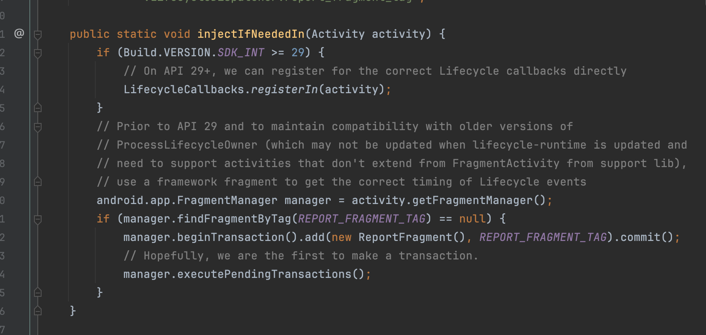
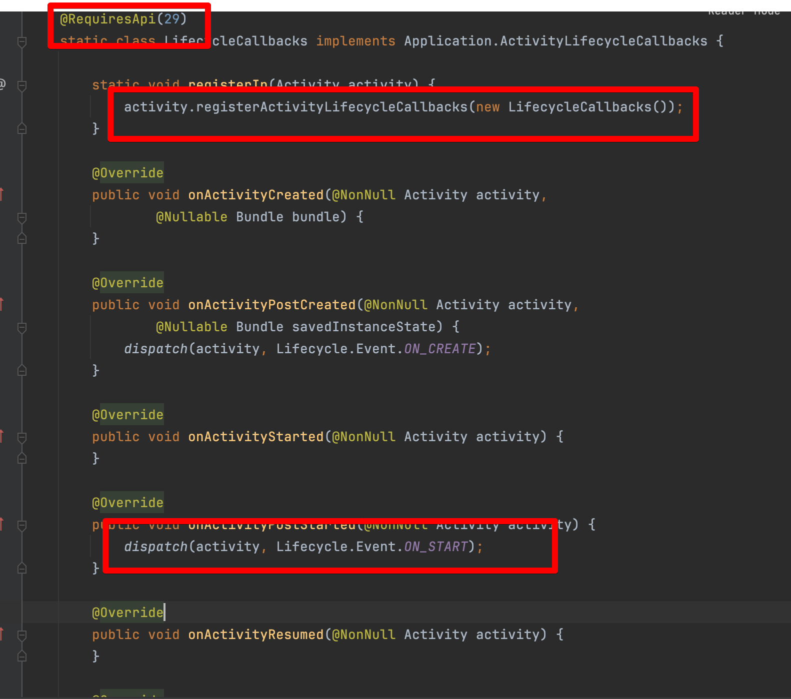
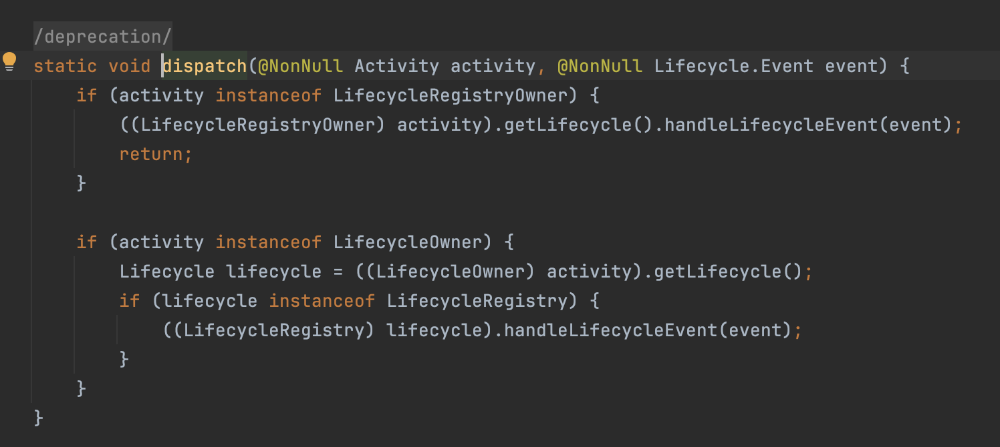
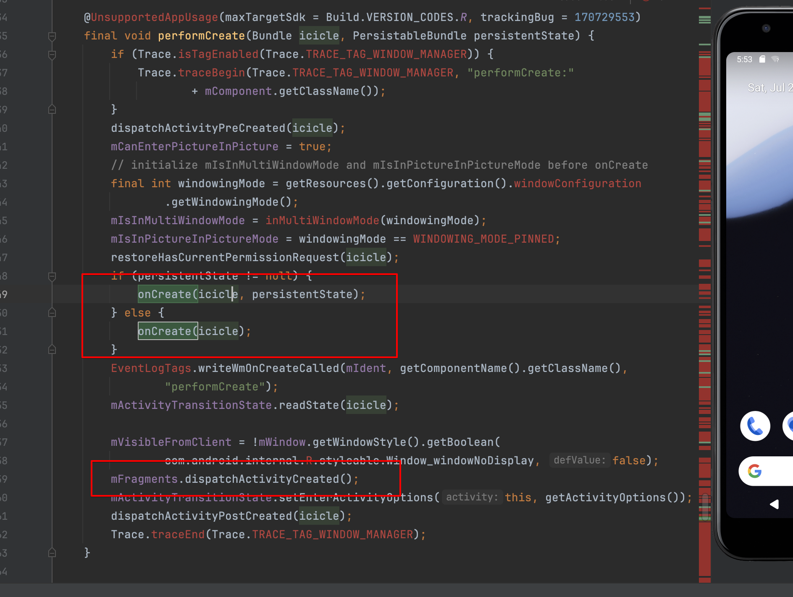
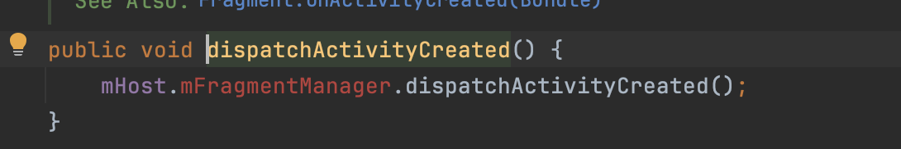
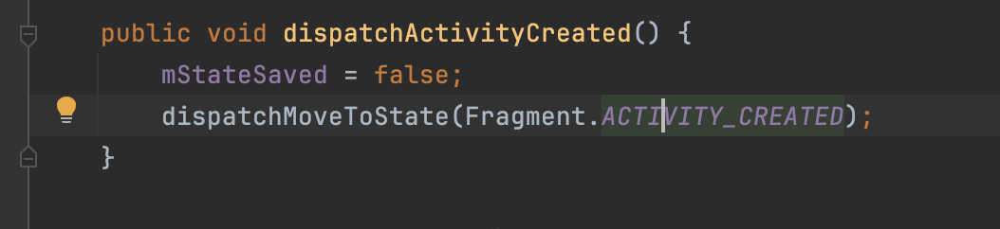
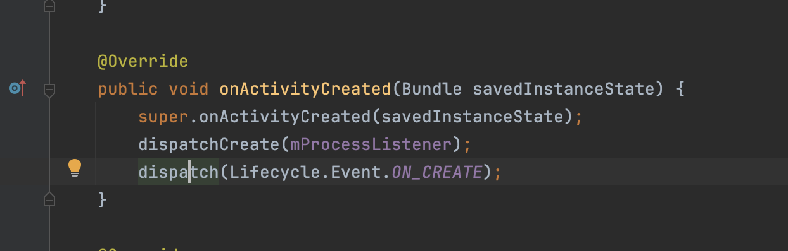
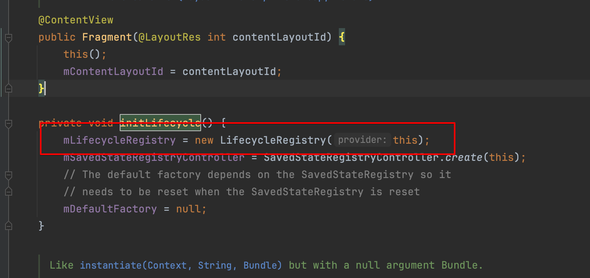
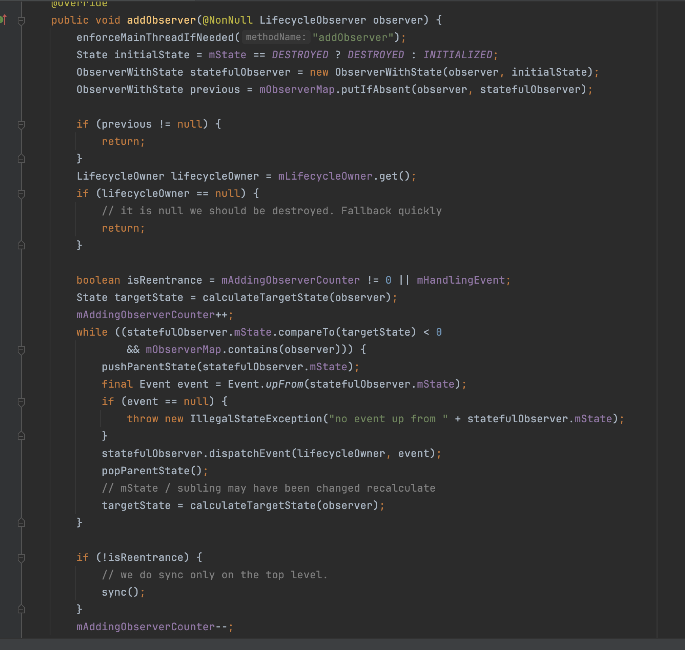
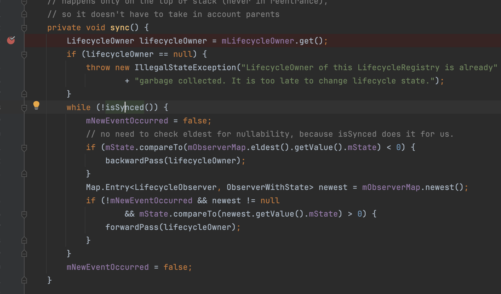

## Lifecycle

用于存储有关组件（如 activity 或 fragment）的生命周期状态的信息，并允许其他对象观测此状态。

其状态流转为 INITIALIZED -> CREATED -> STARTED -> RESUMED -> STARTED -> CREATED -> DESTORYED

观察者一般是实现了 DefaultLifecycleObserver 接口来监控组件的生命周期状态。然后，可以通过调用 Lifecycle 类的 addObserver() 方法并传递观测者的实例来添加观测者

```kotlin
class MyObserver : DefaultLifecycleObserver {
    override fun onResume(owner: LifecycleOwner) {
        connect()
    }

    override fun onPause(owner: LifecycleOwner) {
        disconnect()
    }
}

myLifecycleOwner.getLifecycle().addObserver(MyObserver())
```

### LifecycleOwner
是只包含一个方法的接口，指明类具有 Lifecycle. `ComponentActivity` 与 `Fragment` 均实习了 LifecycleOwner。
原来对于我们需要管理生命周期的对象，可以统一包一层，将Lifecycle 传过去，由管理的对象 自给自足。
``` java

class TestActivity : FragmentActivity() {

    // listener1　tranditional solution, need call onStart onStop
    val listener1: Listener1 = Listener1()
    
    // listener2　tranditional solution, onStart onStop will be called inner
    val listener2: Listener2 = Listener2(this)

    override fun onStart() {
        super.onStart()
        listener1.onConnect()
    }

    override fun onStop() {
        super.onStop()
        listener1.onDisConnect()
    }

}


class Listener1() {

    fun onConnect() {
        println("Listener1.onConnect")
    }

    fun onDisConnect() {
        println("Listener1.onDisConnect")
    }
}

class Listener2(val lifecycleOwner: LifecycleOwner) : DefaultLifecycleObserver {

    init {
        lifecycleOwner.lifecycle.addObserver(this)
    }

    override fun onStart(owner: LifecycleOwner) {
        println("Listener2.onConnect")
    }

    override fun onStop(owner: LifecycleOwner) {
        println("Listener2.onDisConnect")
    }

}
```

注意一点 lifecycle 的 CREATED 状态再 Activity 中的 onCreate 是不能达到的，其只能达到 INITALIZESD。 在performCreate最后才能达到 CREATED 状态，同理 STARTED，RESUMED。

在非LifecycleObserver回调函数中，可以通过 lifecycleOwner.lifecycle.currentState 获取当前状态。

### LifecycleOwner

如果您有一个自定义类并希望使其成为 LifecycleOwner，您可以使用 LifecycleRegistry 类，主要是针对于 Activity 和 Fragment 两种，除此之外想不到有什么应用场景

### 源码

#### common
lifecycle 核心定义位于此处

##### lifecycle
addObserver，removeObserver，getCurrentState， Event，State

##### LifecycleObserver
空实现，主要看 DefaultLifecycleObserver

##### LifecycleOwner 
提供 Lifecycle 的类


#### runtime
运行时核心 仅ReportFragment LifecycleRegistry LifecycleRegistryOwner （ViewTreeLifecycleOwner 忽略）ReportFragment是 LifecycleOwner 提供来源，LifecycleRegistry是Lifecycle更新的核心

##### ReportFragment
###### ComponentActivity 配合实现
ComponentActivity 实现了 LifecycleRegistry，但是并没有直接在 ComponentActivity 的各个回调中进行 LifecycleRegistry 的状态设置，而是通过 ReportFragment 又导了一下。

ComponentActivity.onCreate 方法中，调用了 ReportFragment.injectIfNeededIn(this);方法。



ReportFragment 判断 Android 》=29 ，那么会调用 LifecycleCallbacks，将其自身注册给 最底层的 Activity的registerActivityLifecycleCallbacks方法。这个方法是activity所有生命周期的回调都能走到，每种状态的 pre on post 都能走到。这样直接就完成了注册，其收到回调后，通过 dispatch 方法，直接将对应的事件抛出。


最后判断是否实现了 LifecycleRegistry，直接进行状态设置就可以了




如果小于 29，没有ActivityLifecycleCallbacks这个接口，那么就会创建一个 ReportFragment 并添加到Activity上，因为fragment整个回调时机是和activity强相关的，因此，收到了fragment的回调就是收到了 activity的回调。

这里以 onCreate 为例：

activity是在 performCreate中调用的 onCreate，之后紧接着就会调用 mFragments.dispatchActivityCreated();






这样，fragment 实际上最后是到了Fragment.ACTIVITY_CREATED状态，最后fragment经过状态流转之后，onActivityCreated 收到回调，fragment把这个状态抛出去




以上就是Activity 运行时获取当前状态的实现。

###### Fragment 配合实现
Fragment 相比来说朴实无华。同样是使用 LifecycleRegistry，更为直接的是直接在对应 方法中调用 状态设置。



##### LifecycleRegistry 
是真正分发事件给 Observer 的核心，也是事件更新的核心

###### addObserver
添加观察者，会将当前的观察者和初始化状态（非当前状态）拟合起来，存储到mObserverMap中，方便之后获取。同时会，对状态进行获取，将最新的状态更新到当前状态，通知观察者。

###### moveToState
更新状态函数，最后会调用到sync方法。


最后来更新

