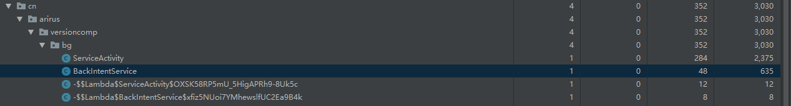

# 写在最前面

上一篇中我们学习了，Service 的基本用法，两种使用方式，不同的处理。本篇中，我们来通过源码的方式来对 IntentService 和 JobIntentService 进行下总结。看看什么情况下使用这两种特殊的 Service。

<!--more-->

# IntentService

## IntentService 特点

之前我们说过以 startService 方式来启动的 Service 有两个特点：

    1.Service 本身运行在启动线程，通常是主线程；
    2.Service 在执行完成后不会主动暂停，只有使用 stopSelf 或者 stopService 才会使得服务停止；
针对这两个特点，提出了 IntentService。这个类是 Service 的一个子类。其原理也很简单，内部使用了一个  HandlerThread 和 Handler ，使得 Service 整体工作在 HandlerThread 工作线程,同时重写了 onStartCommand 使得我们不需要考虑如何切换到工作线程，并且使用 Handler 机制，使得事件一个个的传递，并且在全部处理结束完成后关闭服务。这种`工作队列处理`模型很适合从主线程启动的高负载任务，所有的请求都会被唯一一个工作线程所处理，但是不支持多线程处理也就是一个时刻只能处理一个事件。由于其源码比较简单，我们可以大致分享一下（可能是我看过最简单的源码了）。

## IntentService 源码

```java
public abstract class IntentService extends Service {
    private volatile Looper mServiceLooper;
    private volatile ServiceHandler mServiceHandler;
    private String mName;
    private boolean mRedelivery;

    //ServiceHandler 本质上是以个 Handler
    private final class ServiceHandler extends Handler {
        public ServiceHandler(Looper looper) {
            super(looper);
        }

        @Override
        public void handleMessage(Message msg) {
            onHandleIntent((Intent)msg.obj);
            stopSelf(msg.arg1);
        }
    }

    public IntentService(String name) {
        super();
        mName = name;
    }

    public void setIntentRedelivery(boolean enabled) {
        mRedelivery = enabled;
    }

    @Override
    public void onCreate() {
        // 创建工作线程 HandlerThread 并把线程中的 Looper 和 ServiceHandler 绑定到一起
        super.onCreate();
        HandlerThread thread = new HandlerThread("IntentService[" + mName + "]");
        thread.start();

        mServiceLooper = thread.getLooper();
        mServiceHandler = new ServiceHandler(mServiceLooper);
    }

    @Override
    public void onStart(@Nullable Intent intent, int startId) {
        //为了兼容早期没有 onStartCommand 版本的 Service，收到数据后封装到 Message 中
        // 并抛到 ServiceHandler 中
        Message msg = mServiceHandler.obtainMessage();
        msg.arg1 = startId;
        msg.obj = intent;
        mServiceHandler.sendMessage(msg);
    }

    @Override
    public int onStartCommand(@Nullable Intent intent, int flags, int startId) {
        onStart(intent, startId);
        return mRedelivery ? START_REDELIVER_INTENT : START_NOT_STICKY;
    }

    @Override
    public void onDestroy() {
        // 服务退出的时候，将 Looper 退出，避免 Thread 无法结束，导致内存泄漏
        mServiceLooper.quit();
    }

    @Override
    @Nullable
    public IBinder onBind(Intent intent) {
        return null;
    }

    //用户自己实现
    @WorkerThread
    protected abstract void onHandleIntent(@Nullable Intent intent);
}
```

将注释删除后，源码只有这么多，在 onCreate 方法时，Handler 被创建起来，同时和 HandlerThread 的 Looper 绑定了一起，就是说 Handler 会一直处理 Looper 循环里的数据。每次有新的 startService 调用时，总会调用到 onStart 方法中的 `mServiceHandler.sendMessage(msg)` 这样便把一个信息抛到 MessageQuene 中，等时机合适的时候，会被 ServiceHandler 的 handleMessage 接受到，同时抛向 onHandleIntent 方法。这个方法由用户自己实现，用来处理 startService 的请求。同时在 onHandleIntent 方法结束后，调用 stopSelf（startId）来结束 Service。

原理很简单，这里我们来给出一个 DEMO：

```java
public class BackIntentService extends IntentService {

  public BackIntentService() {
    super("BackIntentService");
  }

  @SuppressLint("CheckResult")
  @Override
  protected void onHandleIntent(@Nullable Intent intent) {
    Observable.create((ObservableOnSubscribe<Long>) emitter -> {
      int index = 1;
      while (index<10){
        emitter.onNext(Long.valueOf(index));
        Thread.sleep(1000);
        index++;
      }
    }).subscribe(aLong -> {
      Log.i(ARIRUS, "onCreate: " + aLong + " " + isMyServiceRunning(BackIntentService.class));
    });
    Log.i(ARIRUS, "onHandleIntent: ");
  }

}

log:
onCreate: 1 true
onCreate: 2 true
onCreate: 3 true
onCreate: 4 true
onCreate: 5 true
onCreate: 6 true
onCreate: 7 true
onCreate: 8 true
onCreate: 9 true
onHandleIntent:
```

注意由于 Observable.intervalRange() 会后台另起计算线程来进行数据产生，所以我们要手动实现上流数据源，让其产生并工作在当前线程。最后当10个数据记录结束后，onHandleIntent 返回，同时结束了服务。

## ServiceLooper.quit

这个方法，我觉得是整个 IntentService 中最值得注意的地方，因为平时我们写代码时是不在意这种细枝末节的。这个方法，如果不调用会怎么样？这个方法如果不调用那么，HandlerThread 会一直在运行，那么 HandlerThread 无法退出，最终会造成内存泄漏。上图



这个是我把 BackIntentService 中 onDestory 方法的 super 方法去掉后的内存分析结果，此时当 stopSelf 调用之后，BackIntentService 的实例依然没有被回收。 那我觉的有必要好好看看 HandlerThread 的逻辑了。

## HandlerThread 源码

```java

public class HandlerThread extends Thread {
  Looper mLooper;
  ...
  @Override
    public void run() {
        mTid = Process.myTid();
        Looper.prepare();
        synchronized (this) {
            mLooper = Looper.myLooper();
            notifyAll();
        }
        Process.setThreadPriority(mPriority);
        onLooperPrepared();
        Looper.loop();
        mTid = -1;
    }
    ...
    public boolean quit() {
        Looper looper = getLooper();
        if (looper != null) {
            looper.quit();
            return true;
        }
        return false;
    }
    ...
}
```

我们知道，Thread 需要实现 run 方法才能进行执行，那我们来看其方法的实现。首先是 Looper.prepare() 来准备 looper，接着加锁来获取 looper，最后就是进行 Looper.loop() 的循环，我们再看下 loop() 方法：

```java
public static void loop() {
    final Looper me = myLooper();
    ...
    final MessageQueue queue = me.mQueue;
    ...
    for (;;) {
        Message msg = queue.next(); // might block
        if (msg == null) {
            // No message indicates that the message queue is quitting.
            return;
        }
        msg.target.dispatchMessage(msg);
    }
    ...
}
```

loop 方法已经很明显了，循环的从 Looper 中取出数据，然后发送到相应的 TargetHandler 中进行处理，如果当前队列中没有了 message 直接退出就好了。那么退到了 HandlerThread 的 run 方法中，最后 Thread 结束运行。一个 HandlerThread 便结束了运行。再回到最开始 mServiceLooper.quit() 方法：

```java
void quit(boolean safe) {
...
    if (safe) {
        removeAllFutureMessagesLocked();
    } else {
        removeAllMessagesLocked();
    }
...
}

private void removeAllMessagesLocked() {
    Message p = mMessages;
    while (p != null) {
        Message n = p.next;
        p.recycleUnchecked();
        p = n;
    }
    mMessages = null;
}
```

很清晰，就是把 MessageQueue 的所有 message 全都回收了，也就是消息队列中不再含有任何 msg ，那么在 Looper.loop() 方法中会直接 return，HandlerThread 结束了 run，系统可以将其回收了。所以如果在重写 onDestory 方法中如果没得调用 super 方法，HandlerThread 会一直持有外部类的引用这里就是 BackIntentService ，最终造成内存泄漏。

## 结论

IntentService 是以个在处理后台任务上非常有用的工具，使用他我们不用担心线程的切换，可以直接在 onHandleIntent 方法中，做耗时的操作；同样也不需要关心停止 Service 的操作，当没有 msg 时会自动结束 Service 服务。当然也有缺陷：任务是按照顺序在工作线程中执行，不能并发执行；一个请求在执行的时候是无法被打断的。

# JobIntentService

这里还没想好怎么写，占个坑。