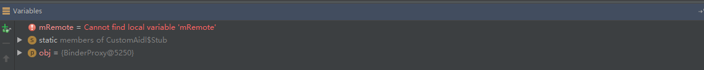

# 写在最前面

上篇，我们接触了 Parcel，Android 钦定的 IPC 的数据传输体，那么今天我们就开始真正的接触跨进程通信。好了，这就开始了，本篇大部分东西都是参看了罗升阳老师和田维数老师的相关材料包括但不限于博客和书籍，这里再次表示感谢。

# 跨进程通信

操作系统的不同进程之间，数据不共享；这么做的主要原因当然是出于安全的考虑，不然你通过 Web 来看下一些不可描述的网站，整个系统的 App 都知道了，就跟当年陈老师一样，所以不同的进程之间必须的是相互隔离的，既然有隔阂那也必须有桥梁，不然各个进程都互相不知道，你连剪贴板都用不了，这个桥梁就是跨进程机制。而这个机制在 Android 上就是 Binder 机制。

Android 使用的 Linux 内核拥有着非常多的跨进程通信机制，比如管道，System V，Socket 等；为什么还需要单独搞一个 Binder 出来呢？主要有两点，性能和安全。在移动设备上，广泛地使用跨进程通信肯定对通信机制本身提出了严格的要求；Binder 相对于传统的 Socket 方式，更加高效；另外，传统的进程通信方式对于通信双方的身份并没有做出严格的验证，只有在上层协议上进行架设；比如 Socket 通信 ip 地址是客户端手动填入的，都可以进行伪造；而 Binder 机制从协议本身就支持对通信双方做身份校检，因而大大提升了安全性。这个也是 Android 权限模型的基础。

<!--more-->

# Binder 
Binder 的通信模型是传统的 Client - Server 模型，即一端向另一端进行请求，另一端进行回复。当然在这整个过程中，两个角色不是绝对的不变的。其原理大致如下：


有关 Binder 的通信模型网上有一个打电话的举例则是非常形象的，这里就不赘述了。因此 Binder 跨进程原理可以大致描述为以下的步骤：

- Server 经过 Binder 驱动的包装，到 ServiceManager 中进行注册，ServiceManager 中其实持有的也不是 Server 的本体只是它的一个代理。
- Client 想调用某个 Server 的方法，去 ServiceManager 中查询。同时 ServiceManager 会把一个 Server 的代理返回给 Client。
- Client 不知道拿到的是代理，直接调用了代理对象的方法，直接把参数做一些包装然后直接转发给 Binder 驱动。
- Binder 驱动收到发现，这个是个代理，直接就找到原始 Server ，通知其将方法的调用结果返回。
- 收到 Server 方法结果的 Binder 将结果返回给 Client。跨进程通信就结束了。

一句话总结就是：Client 进程只不过是持有了 Server 端的代理；代理对象协助驱动完成了跨进程通信。

## Binder 角色区分
Binder 在不同的情境下，所代表的定位也是不同。引用田维数老师的博客，通常有下面4个区分：

- 通常意义下，Binder 指的是一种通信机制；我们说 AIDL 使用 Binder 进行通信，指的就是 Binder 这种 IPC 机制。
- 对于 Server 进程来说，Binder 指的是 Binder 本地对象( Binder )
- 对于 Client 来说，Binder 指的是 Binder 代理对象( BinderProxy )，它只是 Binder 本地对象的一个远程代理；对这个 Binder 代理对象的操作，会通过驱动最终转发到 Binder 本地对象上去完成；对于一个拥有 Binder 对象的使用者而言，它无须关心这是一个 Binder 代理对象还是 Binder 本地对象；对于代理对象的操作和对本地对象的操作对它来说没有区别。
- 对于传输过程而言，Binder 是可以进行跨进程传递的对象；Binder 驱动会对具有跨进程传递能力的对象做特殊处理：自动完成代理对象和本地对象的转换。

里面的一句总结很到位：Binder对象是一个可以跨进程引用的对象，它的实体（本地对象）位于一个进程中，而它的引用（代理对象）却遍布于系统的各个进程之中。Binder模糊了进程边界，淡化了进程间通信过程，整个系统仿佛运行于同一个面向对象的程序之中。

## Java 层 Binder 对象
Binder 在 Java 层的分类特别细，包括接口和类有好几个，这里我们结合 Binder 的角色区分进行分别说明。

- IBinder 是一个接口，它代表了一种跨进程传输的能力；只要实现了这个接口，就能将这个对象进行跨进程传递；这是驱动底层支持的；在跨进程数据流经驱动的时候，驱动会识别 IBinder 类型的数据，从而自动完成不同进程 Binder 本地对象以及 Binder 代理对象的转换。这也是为什么`远程服务`在绑定的时候和 onServiceConnected 连接建立时，返回的是一个 IBinder 这么一个抽象接口，而非 Binder。
- IInterface 其实在上面的角色区分中不属于任何一个角色，其是一个本地 Binder 与远程 Binder 调用契约，两个 Binder 完全遵循这个契约（方法对应实现），AS 根据 IInterface 来生成相应的中间对象。
  只有一个接口函数：检索与此接口关联的Binder对象。必须使用此对象而不是普通的强制转换，以便代理对象可以返回正确的结果。主要是通过这个函数将本地本地binder与远程binder进行内容转换给。
- Binder 其实就是 Binder 本地对象。就是在`远程服务`绑定时，Service 返回的 IBinder。AIDL 中其实就是 Stub 对象。
- BinderProxy Binder 的远程对象。就是在`远程服务`绑定时，onServiceConnected 接受的 IBinder。

基本上 Java 层的实现还是非常清晰的，下面我们就结合 AIDL 来对 Binder 机制做一个整体的分析。

# AIDL
[Android 接口定义语言( AIDL )](https://developer.android.com/guide/components/aidl?hl=zh-cn)，Android 可以利用它定义客户端与服务使用进程间通信 (IPC) 进行相互通信时都认可的编程接口。AIDL 支持的类型为以下几种：

- 基本数据类型（int，long，char，boolean，double，float）
- String 和 CharSequence
- List 只支持 ArrayList，同时元素要能被 AIDL 支持
- Map 只支持 HashMap，同时元素要能被 AIDL 支持
- Parcelable 对象
- AIDL 所有 AIDL 接口本身也可被 AIDL 所支持

本次简单实现暂时就以最简单的基本类型和 String 作为例子，Parcelable 和 AIDL 类型的支持，我们会在后面涉及到。
## 简单实现
上面说完了 Binder ，这里我们给出一个最简单的 AIDL 的例子，看看实践中应该怎么写，具体详细的规则还是查阅文档，这里我们直接给出示例。简单起见，我们就使用`远程服务`来进行说明：

第一步，定义 AIDL 文件：
```java
interface IMyAidlInterface {
    int getPid();

    void basicTypes(int anInt, long aLong, boolean aBoolean, float aFloat,
            double aDouble, String aString);
}
```
这里定义了一个 AIDL 文件，其内部只有一个接口，有两个接口方法。第一个方法返回 int 值，参数为空。第二个方法，参数为6个基本类型，返回为空。

第二步，创建 Service，实现 Binder 接口
```java
public class BackRemoteService extends Service {

  @Override
  public IBinder onBind(Intent intent) {
    return mBinder;
  }

  private IMyAidlInterface.Stub mBinder = new IMyAidlInterface.Stub() {
    @Override
    public int getPid() throws RemoteException {
      return getPid();
    }

    @Override
    public void basicTypes(int anInt, long aLong, boolean aBoolean, float aFloat, double aDouble,
        String aString) throws RemoteException {
      Log.i(ARIRUS, "basicTypes: "+anInt+" "+aLong+" "+aBoolean+" "+aFloat+" "+aDouble+" "+aString);
    }
  };
}
```
这里是使用的生成的 IMyAidlInterface.Stub 实例，作为的 Binder 接口。

第三步，向客户端公开该接口。
```java
Intent intent = new Intent(this, BackRemoteService.class);
bindService(intent, new ServiceConnection() {
@Override
public void onServiceConnected(ComponentName name, IBinder service) {
    IMyAidlInterface remoteService = IMyAidlInterface.Stub.asInterface(service);
    try {
    remoteService.basicTypes(1,2,true,4f,5,"hello ipc");
    Log.i("onServiceConnected",remoteService.getPid());
    } catch (RemoteException e) {
    e.printStackTrace();
    }
}

@Override
public void onServiceDisconnected(ComponentName name) {
}
}, BIND_AUTO_CREATE);
```
类似于使用`本地服务`，将 IBinder 转换成自定义的 Binder ，将 IBinder，转换成 IMyAidlInterface，便可以调用定义的方法。最终的结果就是，如实显示出相应的信息，这里就不再单独展示了。

## IMyAidlInterface.java
IMyAidlInterface.java 就是契约 IMyAidlInterface.aidl 生产的文件，这个文件也是我们在 Java 端理解 Binder 重要部分，我们先宏观的看下这个文件都有哪些部分，分别干了什么，最后再来看细节，理清整个过程。
```java
package cn.arirus.versioncomp.ipc;

public interface CustomAidl extends android.os.IInterface{

  public static abstract class Stub extends android.os.Binder implements cn.arirus.versioncomp.ipc.CustomAidl  {

    private static final java.lang.String DESCRIPTOR = "cn.arirus.versioncomp.ipc.CustomAidl";
    /** Construct the stub at attach it to the interface. */
    public Stub(){this.attachInterface(this, DESCRIPTOR);}

    public static cn.arirus.versioncomp.ipc.CustomAidl asInterface(android.os.IBinder obj){...}

    @Override public android.os.IBinder asBinder(){return this}

    @Override public boolean onTransact(int code, android.os.Parcel data, android.os.Parcel reply, int flags) throws android.os.RemoteException{...}

    private static class Proxy implements cn.arirus.versioncomp.ipc.CustomAidl{...}

    static final int TRANSACTION_basicTypes = (android.os.IBinder.FIRST_CALL_TRANSACTION + 0);
    static final int TRANSACTION_getData = (android.os.IBinder.FIRST_CALL_TRANSACTION + 1);
  }
  /**
      * Demonstrates some basic types that you can use as parameters
      * and return values in AIDL.
      */
  public void basicTypes(int anInt, long aLong, boolean aBoolean, float aFloat, double aDouble, java.lang.String aString) throws android.os.RemoteException;

  public cn.arirus.versioncomp.ipc.PojoParcel getData(int id, java.lang.String title, cn.arirus.versioncomp.ipc.PojoParcel pojo) throws android.os.RemoteException;
}
```
将细节屏蔽后，文件的整体展示清晰了许多，文件中包含了一个接口 CustomAidl 和 两个类 CustomAidl.Stub 、CustomAidl.Stub.Proxy。其中 CustomAidl.Stub 继承于 Binder 因此这就是我们上文说的，Server 端的本地 Binder。CustomAidl.Stub.Proxy 很值得玩味了，首先它是一个 private 类，因此是不对外暴露的，其次实现 CustomAidl 接口的方法，但是本身既不是继承于 Binder 也没有实现 IBinder 接口，那么他具体作用是什么我们下面再看。

## Debug 来看 IMyAidlInterface.java 
由于 IMyAidlInterface.java 较为复杂，我们还是老办法使用 Debug 的方式来看看是怎么一个流程。

### 本地服务
我们知道，当我们绑定一个本地服务时，是不需要定义 AIDL 文件的，那假如，我想通过 AIDL 来绑定一个本地服务，会是什么效果，那么这里我们把上面 Manifest 文件 Service 的注册信息中 process 字段删掉。运行一下调用到 asInterface 方法中：
```java
public static CustomAidl asInterface(IBinder obj) {
  if ((obj == null)) {
    return null;
  }
  IInterface iin = obj.queryLocalInterface(DESCRIPTOR);
  if (((iin != null) && (iin instanceof CustomAidl))) {
    return ((CustomAidl) iin);
  }
  ...
}
```
通过 Debug 信息来看，obj 就是 Binder 。


 其实就是 CustomAidl.Stub，因为 CustomAidl.Stub 实现了 CustomAidl。因此会直接返回，我们在 BackRemoteService 中实现了 CustomAidl.Stub 的实例。所以我们可以看到对于本地服务，AIDL 会直接返回，我们实现的 CustomAidl.Stub 实例。

所以，当我们在绑定本地服务时，如果使用 AIDL，其实生成的 asInterface 方法会判断，如果本身就是 Binder 而不是所谓的 BinderProxy 代理，会直接调用重写生成的 CustomAidl.Stub 来作为本地 Binder 进行调用。那么完全是不需要 Binder 驱动来进行操作，因为都是在一个进程当中的。所以对于，绑定本地服务使用 AIDL，可以理解成是没有任何效果的，和自己定义生成 Binder 是完全一样的。

### 远程服务
好了，那再回到如果使用远程服务，又会是怎样的情况的？我们把 Manifest 文件的 Service 注册信息还修改回来，重新进行 Debug 来看。
```java
public static cn.arirus.versioncomp.ipc.CustomAidl asInterface(android.os.IBinder obj){
  ...
  return new cn.arirus.versioncomp.ipc.CustomAidl.Stub.Proxy(obj);
}
```
这次参数 obj 不再是一个 Binder 对象，而是一个 BinderProxy 对象。

 

我们知道这个 BinderProxy 对象并没有继承 CustomAidl 接口，自然判断无法通过，因此会返回一个 CustomAidl.Stub.Proxy 对象，并将 BinderProxy 传递过去。所以我们大致知道了，这个 CustomAidl.Stub.Proxy 类应该就是来处理 BinderProxy 对象的。接下来，我们来研究下这个 CustomAidl.Stub.Proxy 都做了什么事儿（以下都简写为 Proxy）。

#### Proxy 方法调用
由于我在上面写了，在获得 CustomAidl 实例，调用了 basicTypes 方法。因此会调用 Proxy.basicTypes 方法。
```java
@Override public void basicTypes(int anInt, long aLong, boolean aBoolean, float aFloat, double aDouble, String aString) throws android.os.RemoteException{
  Parcel _data = Parcel.obtain();
  Parcel _reply = Parcel.obtain();
  try {
  _data.writeInterfaceToken(DESCRIPTOR);
  _data.writeInt(anInt);
  _data.writeLong(aLong);
  _data.writeInt(((aBoolean)?(1):(0)));
  _data.writeFloat(aFloat);
  _data.writeDouble(aDouble);
  _data.writeString(aString);
  mRemote.transact(Stub.TRANSACTION_basicTypes, _data, _reply, 0);
  _reply.readException();
  }
  finally {
  _reply.recycle();
  _data.recycle();
  }
}
```
上一篇中我们说过了 Parcel 的用法，这里就是挨个把参数写入，同时还写入当前 Interface 的 Token 作为标识。最后调用了 mRemote.transact 方法，这个 mRemote 就是一开始传入的 obj ，我们知道是一个 BinderProxy，而 BinderProxy.transact 方法最终在参数合法性检查完毕后就调用了 native 方法。值得注意的是用的索引值来表示方法的调用，而非函数名，想想也对，函数名其实就是内存地址，跨进程没法传。
```java
public boolean transact(int code, Parcel data, Parcel reply, int flags) throws RemoteException {
    Binder.checkParcel(this, code, data, "Unreasonably large binder buffer");
    ...
    try {
        return transactNative(code, data, reply, flags);
    } finally {
        if (tracingEnabled) {
            Trace.traceEnd(Trace.TRACE_TAG_ALWAYS);
        }
    }
}
```
至此，Client 端的 BinderProxy 调用就结束了。

#### Stub 方法调用
Client 端方法调用完成，那么就该 Server 端接受调用了。首先被调用到的是 onTransact 方法。
```java
@Override public boolean onTransact(int code, android.os.Parcel data, android.os.Parcel reply, int flags) throws android.os.RemoteException{
  java.lang.String descriptor = DESCRIPTOR;
  switch (code){
    ...
    case TRANSACTION_basicTypes:{
      data.enforceInterface(descriptor);
      int _arg0;
      _arg0 = data.readInt();
      long _arg1;
      _arg1 = data.readLong();
      boolean _arg2;
      _arg2 = (0!=data.readInt());
      float _arg3;
      _arg3 = data.readFloat();
      double _arg4;
      _arg4 = data.readDouble();
      java.lang.String _arg5;
      _arg5 = data.readString();
      this.basicTypes(_arg0, _arg1, _arg2, _arg3, _arg4, _arg5);
      reply.writeNoException();
      return true;
    }
    default:{
      return super.onTransact(code, data, reply, flags);
    }
  }
}
```
处于简单起见，我们把另外的 switch 分钟都去掉了，只留 TRANSACTION_basicTypes 分支。先来验证 Transact 是否于当前目标 Interface 相匹配，个人猜测就是使用 descriptor 和之前 Client 端调用时，写入的 InterfaceToken 来做比对，因此之前的 Proxy 是在 C 端完成的，现在 S 端当然要做一个校验。然后依次从 Parcel 中读取数据，最后调用了本身的 basicTypes 方法，由于我们之前已经实现了这个方法，那么毫无疑问会直接调用到方法中。这里我们就不展示了。这样对于 S 端的调用也就完成了。

上面是属于 S 端无返回的调用，让我们再看看如果，是有返回的调用会是怎样的过程。
```java
@Override public boolean onTransact(int code, android.os.Parcel data, android.os.Parcel reply, int flags) throws android.os.RemoteException{
  switch (code){
    case TRANSACTION_getPid:{
      data.enforceInterface(descriptor);
      int _result = this.getPid();
      reply.writeNoException();
      reply.writeInt(_result);
      return true;
    }
  }
}
```
这个是调用定义的第二个方法，调用了 getPid 方法，直接将 result 写入了 reply 中，并直接结束了 onTransact 方法。C 端收到返回的结果，会结束挂起线程继续执行：
```java
@Override public int getPid() throws android.os.RemoteException{
  Parcel _data = Parcel.obtain();
  Parcel _reply = Parcel.obtain();
  int _result;
  try {
    _data.writeInterfaceToken(DESCRIPTOR);
    mRemote.transact(Stub.TRANSACTION_getPid, _data, _reply, 0);
    _reply.readException();
    _result = _reply.readInt();
  }
  finally {
    _reply.recycle();
    _data.recycle();
  }
  return _result;
}
```
最后从 _reply 中读取了返回结果，最后返回给了最外层的调用者。至此，一次完整的跨进程通信便完成了。可以看到通过 AIDL 的编写，无论是C端还是S端都可以像使用本地对象一样使用需要操作的对象，Binder 的目的也就达到了。本次的示例中，并没有传递 Parcelable 对象，仅仅是以6个基本类型作为参数进行请求。别急，我们有机会会给出一个完整的跨进程通信的例子。

# 小结

本篇中，我们从跨进程的必要性开始，引入了 Binder 的通信模型，解释了 Binder 在跨进程通信时的具体作用，以及各个角色的区别。最后通过 AIDL 的编写体会了一次完整跨进程体验。其实可以看到，Stub 就是本地 Binder，而 Proxy 就是一个辅助类，将请求参数依次写入 Parcel ，最后通过调用的形式传给了 IBinder 的 transact 方法。而S端的 Binder 通过 Binder 驱动在 onTransact 收到相应参数，读取 Parcel 中的真实参数，调用定义的方法，并将结果返回通过 _reply 返回了回去，C 端收到响应，获得结果，跨进程完毕。所以可以看到 transact 方法和 onTransact 才是 AIDL 的核心。
最后给出本地服务和远程服务，流程图

