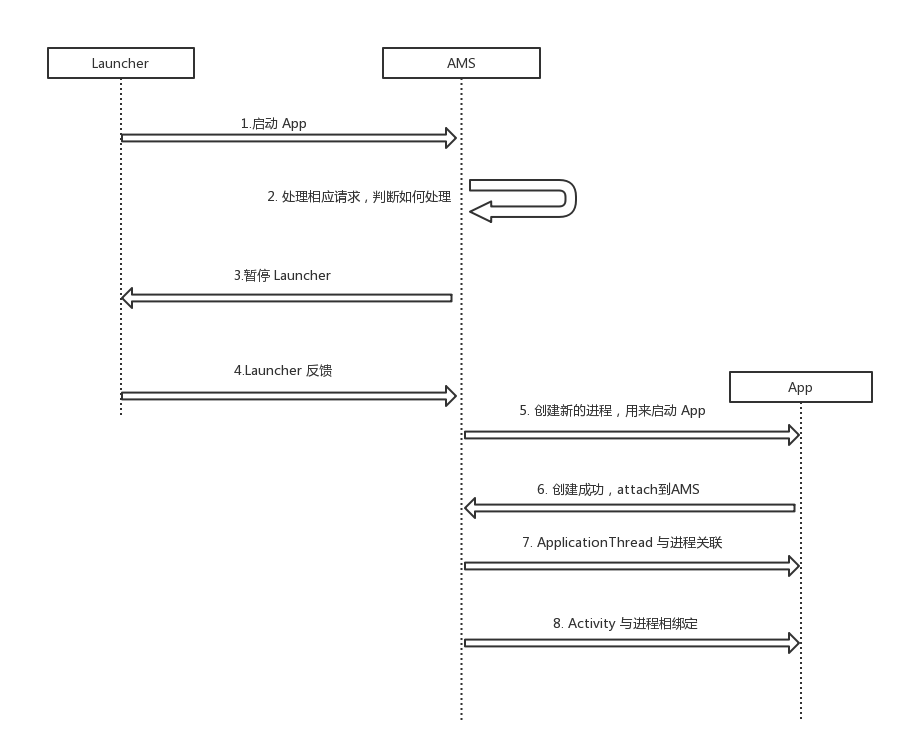

# 写在最前面
上一篇中，我们介绍 Binder 的原理，并简要说明了在应用层 Binder 的主要使用途径 AIDL 的主要写法。本篇中，就结合上一篇的理论，我们来看看如果在 Launcher 中启动一个 App 会是怎样一个流程，会进行几次跨进程的交互。下面直接给出整体的流程图，先有个概念。注意：本文是在 API 25 的源码基础上进行分析的。



<!--more-->

# Launcher 发出请求 
当应用启动时，调用 `startActivtiy( Intent intent )` 最终会进入到 Activity 类中的 startActivityForResult 方法中，这几步比较好跟，就不赘述了。函数内部会调用  Instrumentation.execStartActivity 方法，函数内部会继续调用 ActivityManagerNative.getDefault().startActivityAsUser() 方法。到这儿，启动应用的第一次跨进程通信就开始了。

ActivityManagerNative 有一个静态方法：
```java
static public IActivityManager asInterface(IBinder obj) {
    if (obj == null) {
        return null;
    }
    IActivityManager in =
        (IActivityManager)obj.queryLocalInterface(descriptor);
    if (in != null) {
        return in;
    }

    return new ActivityManagerProxy(obj);
}
```
非常眼熟，像极了上一篇中，CustomAidl.Stub 中的静态方法，判断如果是 LocalInterface（在一个进程中），返回其本身，否则返回一个 ActivityManagerProxy 对象。那我们大致可以猜测，ActivityManagerProxy 应该是类似 CustomAidl.Stub.Proxy ，是对 BinderProxy 的封装，方便外界调用。简单看看 ActivityManagerProxy 定义：
```java
class ActivityManagerProxy implements IActivityManager{
    public ActivityManagerProxy(IBinder remote){
        mRemote = remote;
    }

    public IBinder asBinder(){
        return mRemote;
    }

    public int startActivity(IApplicationThread caller, String callingPackage, Intent intent,
            String resolvedType, IBinder resultTo, String resultWho, int requestCode,
            int startFlags, ProfilerInfo profilerInfo, Bundle options) throws RemoteException {
        Parcel data = Parcel.obtain();
        Parcel reply = Parcel.obtain();
        data.writeInterfaceToken(IActivityManager.descriptor);
        data.writeStrongBinder(caller != null ? caller.asBinder() : null);
        data.writeString(callingPackage);
        ...
        mRemote.transact(START_ACTIVITY_TRANSACTION, data, reply, 0);
        ...
        return result;
    }
    ...
}
```
果然，一模一样的结构。再看 getDefault 方法：
```java
private static final Singleton<IActivityManager> gDefault = new Singleton<IActivityManager>({
    protected IActivityManager create() {
        IBinder b = ServiceManager.getService("activity");
        if (false) {
            Log.v("ActivityManager", "default service binder = " + b);
        }
        IActivityManager am = asInterface(b);
        if (false) {
            Log.v("ActivityManager", "default service = " + am);
        }
        return am;
    }
};
```
差不多，获取 IActivityManager 就是这么个操作。那么剩下我们需要确定的就是 ActivityManagerNative.getDefault() 返回的是一个本地对象还是代理对象？在我们的操作情况下应该是显而易见的，应该是一个代理对象，因为是通过 Launcher 来启动一个 App，Launcher 并不和 ActivityManagerService 在同一个进程，前者是一个应用进程，ActivityManagerService 则属于系统进程，所以返回的一定是一个 ActivityManagerProxy 实例。这样通过调用 ActivityManagerProxy.startActivity 最终调用了 mRemote.transact 方法，Launcher 的启动请求就成功的向 ActivityManagerService 发送出去了。

ActivityManagerService 也是继承于 ActivityManagerNative，那么会收到 ActivityManagerNative.onTransact 调用，最后又调用了本身的 startActivity 方法。跨进程完毕，下面就是 ActivityManagerService 来处理启动逻辑了。

最后，我们看看 ActivityManagerNative ActivityManagerProxy ActivityManagerService IActivityManager 这四个类的定位。IActivityManager 接口类，定义了本地对象和代理对象交互的协议；ActivityManagerNative 类似于 CustomAidl.Stub 半个 Binder 本地对象；ActivityManagerService Binder 本地对象；ActivityManagerProxy Binder 代理的辅助类，用于将参数写入 Parcel 用来交互。这里其实跟上篇的 CustomAidl 几个类的定位一样的，唯一不同是 CustomAidl.Stub 是没有分开的，在 Service 类中直接重写了 CustomAidl.Stub 方法，而 ActivityManagerService 分开了。

# ActivityManagerService 处理请求
一直追踪会调用到 ActivityStarter.startActivityMayWait 方法，这个方法中 resolveActivity 会收集启动 Activity 的相关信息，并保存到intent对象。接着调用 startActivityLocked，startActivityUnchecked ，后面这个方法中会做顶部性判断，判断如果 Activity 已经在栈顶的话，就啥也不做；如果在顶端但是非 Resume 状态，则重新转为 Resume 状态，否则就要重新启动 Activity。接着就是将发起启动的 Activity 置到其自己任务栈的顶端：
```java
final void startActivityLocked(ActivityRecord r, boolean newTask, boolean keepCurTransition, ActivityOptions options) {
    ...
    task = r.task;
    ...
    task.addActivityToTop(r);
    ...
}
```
接着就是调用 mSupervisor.resumeFocusedStackTopActivityLocked，最终调用到 ActivityStack.resumeTopActivityUncheckedLocked 方法中， 它首先看要启动的 Activity 是否就是当前处理Resumed 状态的 Activity，如果是的话，那就什么都不用做，直接返回就可以了；否则再看一下系统当前是否休眠状态，如果是的话，再看看要启动的 Activity 是否就是当前处于堆栈顶端的 Activity，如果是的话，也是什么都不用做。接着调用 startPausingLocked 将当前还在 Resume 状态的 Launcher 暂停：
```java
private final void startPausingLocked(boolean userLeaving, boolean uiSleeping,ActivityRecord resuming, boolean dontWait) {
    if (mPausingActivity != null) {
        ......
    }
    ActivityRecord prev = mResumedActivity;
    if (prev == null) {
        ......
    }
    ......
    mResumedActivity = null;
    mPausingActivity = prev;
    mLastPausedActivity = prev;
    prev.state = ActivityState.PAUSING;
    ......

    if (prev.app != null && prev.app.thread != null) {
        ......
        try {
            ......
            prev.app.thread.schedulePauseActivity(prev, prev.finishing, userLeaving,
                prev.configChangeFlags);
            ......
        } catch (Exception e) {
            ......
        }
    } else {
    ......
```
如果将调用的完整类名表示清楚其实是：ActivityRecord.ProcessRecord.IApplicationThread ,通过调用其 schedulePauseActivity 来通知 Lacuncher 进入 Paused 状态。

# ActivityManagerService 暂停 Launcher
类似于第一次 Launcher 给 AMS 发送启动请求，第二次跨进程发生在 AMS 都进行过了前期的校验工作，可以启动新的进程来链接新的 App，在这之前会先将 Launcher 进行暂停。这也是为什么在创建 Activity 时，前一个的 onPause 会先于后启动的 onCreate。不过这次 CS 的角色发生了改变。

这里调用了 IApplicationThread 的 schedulePauseActivity 方法，类似上面说的 IActivityManager 四个类，这里也有 `IApplicationThread` `ApplicationThreadProxy` `ApplicationThreadNative` `ApplicationThread` 作用也是完全一样的。即在 ActivityManagerService 要通过 ApplicationThreadProxy 发送指令给 Launcher 所在的进程，命令其进入 Paused 状态，实际上收到指令的是 ApplicationThread，最后由其完成状态的转换。
```java
private class ApplicationThread extends ApplicationThreadNative {
    ...
    public final void schedulePauseActivity(IBinder token, boolean finished,
        boolean userLeaving, int configChanges, boolean dontReport) {
    int seq = getLifecycleSeq();
    if (DEBUG_ORDER) Slog.d(TAG, "pauseActivity " + ActivityThread.this
            + " operation received seq: " + seq);
    sendMessage(
            finished ? H.PAUSE_ACTIVITY_FINISHING : H.PAUSE_ACTIVITY,
            token,
            (userLeaving ? USER_LEAVING : 0) | (dontReport ? DONT_REPORT : 0),
            configChanges,
            seq);
    }
    ...
}

public final class ActivityThread {
    private void sendMessage(int what, Object obj, int arg1, int arg2, int seq) {
        if (DEBUG_MESSAGES) Slog.v(
                TAG, "SCHEDULE " + mH.codeToString(what) + " arg1=" + arg1 + " arg2=" + arg2 +
                        "seq= " + seq);
        Message msg = Message.obtain();
        msg.what = what;
        SomeArgs args = SomeArgs.obtain();
        args.arg1 = obj;
        args.argi1 = arg1;
        args.argi2 = arg2;
        args.argi3 = seq;
        msg.obj = args;
        mH.sendMessage(msg);
    }
}
```
在 Launcher 所在的进程中，使用了 Handler 来进行跨线程的通信，不多说了。H 是 ActivityThread 中实现的 Handler 内部类，收到暂停通知后，执行 handlePauseActivity 方法：
```java
private void handlePauseActivity(IBinder token, boolean finished,
    boolean userLeaving, int configChanges, boolean dontReport, int seq) {
    ActivityClientRecord r = mActivities.get(token);
    ...
    if (r != null) {
        ...
        performPauseActivity(token, finished, r.isPreHoneycomb(), "handlePauseActivity");

        ...
        // Tell the activity manager we have paused.
        if (!dontReport) {
            try {
                ActivityManagerNative.getDefault().activityPaused(token);
            ...
        }
        mSomeActivitiesChanged = true;
    }
}
```
进而调用 performPauseActivity，performPauseActivityIfNeeded 方法，后者会在方法中调用 Instrumentation.callActivityOnPause，而 Instrumentation 保存了 Activity 的实例，调用了 performPause 方法，这时 Activity.onPause 方法则被调用了。至此，Launcher 进入了 Paused 状态，第二次跨进程通信完毕。

# Launcher 反馈 ActivityManagerService 
上面的 ActivityThread.handlePauseActivity 方法中，在完成状态的切换，会通过 ActivityManagerNative.getDefault().activityPaused(token) 来通知 ActivityManagerService ，自己完成了要求，那么我们直接看看 ActivityManagerService 在收到通知后进行了什么操作。
```java
public final void activityPaused(IBinder token) {
    final long origId = Binder.clearCallingIdentity();
    synchronized(this) {
        ActivityStack stack = ActivityRecord.getStackLocked(token);
        if (stack != null) {
            stack.activityPausedLocked(token, false);
        }
    }
    Binder.restoreCallingIdentity(origId);
}
```

# ActivityManagerService 创建新进程
当 ActivityManagerService 收到通知，Launcher 完成了 Paused 状态转换，最后就要开启新的进程来运行新的 App。调用到  mStackSupervisor.startSpecificActivityLocked 方法：
```java
void startSpecificActivityLocked(ActivityRecord r, boolean andResume, boolean checkConfig) {
    // Is this activity's application already running?
    ProcessRecord app = mService.getProcessRecordLocked(r.processName, r.info.applicationInfo.uid, true);

    if (app != null && app.thread != null) {
        ...
        realStartActivityLocked(r, app, andResume, checkConfig);
    }
    mService.startProcessLocked(r.processName, r.info.applicationInfo, true, 0,
        "activity", r.intent.getComponent(), false, false, true);
}
```
这里判断我们需要的进程是否存在，如果存在了直接启动相应的 Activity，否则要先创建新的进程，显然进程不存在，那么进而调用到 startProcessLocked 方法，这个方法中调用了 Process.start("android.app.ActivityThread") 方法来创建新的 ActivityThread 进程：
```java
private final void startProcessLocked(ProcessRecord app, String hostingType, String hostingNameStr, String abiOverride, String entryPoint, String[] entryPointArgs) {
    Process.ProcessStartResult startResult = Process.start(entryPoint,
        app.processName, uid, uid, gids, debugFlags, mountExternal,
        app.info.targetSdkVersion, app.info.seinfo, requiredAbi, instructionSet,
        app.info.dataDir, entryPointArgs); 
}
```
我们知道 ActivityThread 是运行在主线程上的，就是在此时进行创建和初始化的。
```java
public final class ActivityThread {
    final ApplicationThread mAppThread = new ApplicationThread();
    final Looper mLooper = Looper.myLooper();
    final H mH = new H();

    private void attach(boolean system) {
        ...
        mSystemThread = system;
        if (!system) {
            ...
            final IActivityManager mgr = ActivityManagerNative.getDefault();
            try {
                mgr.attachApplication(mAppThread);
            } catch (RemoteException ex) {
                throw ex.rethrowFromSystemServer();
            }
            ...
        } 
        ...
    }

    public static void main(String[] args) {
        ...
        Looper.prepareMainLooper();

        ActivityThread thread = new ActivityThread();
        thread.attach(false);

        if (sMainThreadHandler == null) {
            sMainThreadHandler = thread.getHandler();
        }
        ...
        Looper.loop();
        ...
    }
}
```
至此一个新的 ActivityThread 创建完成，同时一个 ApplicationThread 也创建完成，并被 ActivityManagerNative 相关联。

# ActivityManagerService 与进程关联 
在 ActivityThread 方法中，ActivityManagerService 与 ApplicationThread 进行了关联，过程我们都熟悉了，这里就直接看，ActivityManagerService 在关联时都做了什么操作。
```java
private final boolean attachApplicationLocked(IApplicationThread thread,
int pid) {
    ProcessRecord app;
    if (pid != MY_PID && pid >= 0) {
        synchronized (mPidsSelfLocked) {
            app = mPidsSelfLocked.get(pid);
        }
    } else {
        app = null;
    }
    ...
    thread.bindApplication(processName, appInfo, providers, app.instrumentationClass,
        profilerInfo, app.instrumentationArguments, app.instrumentationWatcher,
        app.instrumentationUiAutomationConnection, testMode,
        mBinderTransactionTrackingEnabled, enableTrackAllocation,
        isRestrictedBackupMode || !normalMode, app.persistent,
        new Configuration(mConfiguration), app.compat,
        getCommonServicesLocked(app.isolated),
        mCoreSettingsObserver.getCoreSettingsLocked());
    ...
    // See if the top visible activity is waiting to run in this process...
    if (normalMode) {
        try {
            if (mStackSupervisor.attachApplicationLocked(app)) {
                didSomething = true;
            }
        } catch (Exception e) {
            Slog.wtf(TAG, "Exception thrown launching activities in " + app, e);
            badApp = true;
        }
    }
    ...
}
```
这里简单的来看就是分两步，第一步先将 ApplicationThread 和真实的 Process 信息相关联起来，毕竟上一步中，只是创建了 ApplicationThread ，并没有做设置。第二步就是将栈顶的 Activity 和进程相绑定。

# ApplicationThread 与进程关联 

上面我们分析，ActivityManagerService.attachApplicationLocked 方法中，会调用到 IApplicationThread.bindApplication 方法。我们来看看 ApplicationThread.bindApplication 会干些什么：
```java
private void handleBindApplication(AppBindData data) {
    ...
    mBoundApplication = data;
    ...
    Process.setArgV0(data.processName);
    ...
    mInstrumentation = (Instrumentation) cl.loadClass(data.instrumentationName.getClassName()).newInstance();
    ...
    mInstrumentation.init(this, instrContext, appContext, component, data.instrumentationWatcher, data.instrumentationUiAutomationConnection);
    ...
    Application app = data.info.makeApplication(data.restrictedBackupMode, null);
    mInitialApplication = app;
    ...
    mInstrumentation.callApplicationOnCreate(app);
    ...
}
```
这里能看出来，就是将进程的相关信息和当前的 ApplicationThread 向绑定到一起。并且执行了 Application 的 onCreate 方法。从此之后，Application 实例就存在了。

# Activity 与进程相绑定
当 Application 实例存在后，就要将新的 Activity 和新生成的进程相绑定了。
```java
final boolean realStartActivityLocked(ActivityRecord r, ProcessRecord app, boolean andResume, boolean checkConfig) throws RemoteException {
    ···
    app.thread.scheduleLaunchActivity(new Intent(r.intent), r.appToken,
        System.identityHashCode(r), r.info, new Configuration(mService.mConfiguration),
        new Configuration(task.mOverrideConfig), r.compat, r.launchedFromPackage,
        task.voiceInteractor, app.repProcState, r.icicle, r.persistentState, results,
        newIntents, !andResume, mService.isNextTransitionForward(), profilerInfo);
    ···
}
```
和之前的操作一样，也是一个跨进程操作。我们来看下在 ActivityThread 做了什么：
```java
private void handleLaunchActivity(ActivityClientRecord r, Intent customIntent, String reason) {
    ...
    Activity a = performLaunchActivity(r, customIntent);
    ...
    if (a != null) {
        ...
        handleResumeActivity(r.token, false, r.isForward,
                !r.activity.mFinished && !r.startsNotResumed, r.lastProcessedSeq, reason);
        ...
    }
    ...
}

 private Activity performLaunchActivity(ActivityClientRecord r, Intent customIntent) {
    ...
    activity = mInstrumentation.newActivity(cl, component.getClassName(), r.intent);
    ...
    activity.attach(appContext, this, getInstrumentation(), r.token,
        r.ident, app, r.intent, r.activityInfo, title, r.parent,
        r.embeddedID, r.lastNonConfigurationInstances, config,
        r.referrer, r.voiceInteractor, window);
    ...
    mInstrumentation.callActivityOnCreate(activity, r.state, r.persistentState);
 }

```
到这一步，ActivityThread 通过 performLaunchActivity 启动了一个 Activity，并执行了其 onCreate 方法，这里就不跟进去了。至此，通过 Launcher 启动一个应用的过程就此结束了。

# 小结

本篇我们大致了解一个 Launcher 启动一个 App 的流程是怎么样的。由于不同版本在一些细节上有些小变化，例如在 API 27 时，ActivityManagerNative 就被移除了，使用了 ActivityManager 来代替，但是整体流程还是一样的。整体来说，启动过程比较复杂，代码追踪比较困难，建议一步一步进行。下篇见。