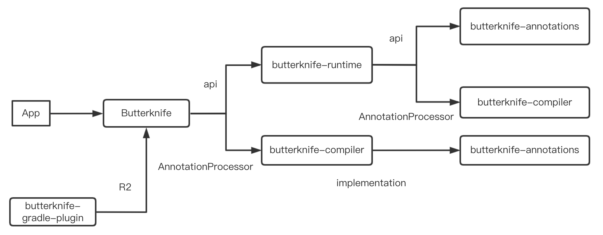

# 写在最前面

这一篇文章其实是计划之外的，因为一开始没想要深究反射效率的问题。但是如果翻了 ButterKnife 项目文件结构的时候，会看到如下结构：

```java
.
├── build.gradle
├── butterknife
│   ├── build
│   ├── build.gradle
│   ├── butterknife.butterknife.iml
│   ├── gradle.properties
│   ├── proguard-rules.txt
│   └── src
├── butterknife-annotations
│   ├── build
│   ├── build.gradle
│   ├── butterknife-annotations.iml
│   ├── gradle.properties
│   └── src
├── butterknife-compiler
│   ├── build
│   ├── build.gradle
│   ├── butterknife-compiler.iml
│   ├── gradle.properties
│   └── src
├── butterknife-gradle-plugin
│   ├── build.gradle
│   ├── butterknife-gradle-plugin.iml
│   ├── gradle.properties
│   └── src
├── butterknife-reflect
│   ├── README.md
│   ├── build
│   ├── build.gradle
│   ├── butterknife-reflect.iml
│   ├── gradle.properties
│   ├── proguard-rules.txt
│   └── src
├── butterknife-runtime
│   ├── build
│   ├── build.gradle
│   ├── butterknife-runtime.iml
│   ├── gradle.properties
│   └── src
├── gradle
│   ├── gradle-mvn-push.gradle
│   └── wrapper
├── gradle.properties
├── gradlew
├── gradlew.bat
├── local.properties
├── sample
│   ├── app
│   ├── library
│   └── sample.iml
├── settings.gradle
└── website
```

核心的工程库有这个几个：`butterknife`，`butterknife-annotations`，`butterknife-compiler`，`butterknife-gradle-plugin`，`butterknife-reflect`，`butterknife-runtime`，`sample.app`，`sample.library` 这个几个。其中依赖关系如下：


这里面只有 `butterknife-runtime` 库，没有在引用链中。而其实这个库有相应的 README，简而言之来说就是：

> 通常的 butterknife 使用编译时注解，生成中间文件，这样有更好的性能。但是 butterknife-runtime 是一个完全运行时的库，通过反射来实现的，性能会差。

那么问题来了，为啥反射的时候性能会差？本篇我们来大致看看。本篇所有的 Java 源码分析都是用的 1.8 的源码。

# 获取方法

上篇中，我们已经说过反射获取一个 `Method` 对象是怎样的：

```java
Method getMethod(String name, Class<?>... parameterTypes);

Method getDeclaredMethod(String name, Class<?>... parameterTypes);
```
我们知道第一个方法是获取 自己 和 父类 所有 `public` 方法，第二个是获取自己所有方法，那我们就分开来看看。

## getMethod
```java
public Method getMethod(String name, Class<?>... parameterTypes)
    throws NoSuchMethodException, SecurityException {
    //校验权限
    checkMemberAccess(Member.PUBLIC, Reflection.getCallerClass(), true);
    //获取方法
    Method method = getMethod0(name, parameterTypes, true);
    if (method == null) {
        throw new NoSuchMethodException(getName() + "." + name + argumentTypesToString(parameterTypes));
    }
    return method;
}
```

简单粗暴，先校验权限后获取方法。我们直接看获取方法的相关内容：
```java
private Method getMethod0(String name, Class<?>[] parameterTypes, boolean includeStaticMethods) {
    MethodArray interfaceCandidates = new MethodArray(2);
    Method res =  privateGetMethodRecursive(name, parameterTypes, includeStaticMethods, interfaceCandidates);
    if (res != null)
        return res;

    // Not found on class or superclass directly
    interfaceCandidates.removeLessSpecifics();
    return interfaceCandidates.getFirst(); // may be null
}

```
分了两步来判断，如果尝试获取method，如果存在就直接返回。如果没有，对接口类型进行查重返回。

看下 privateGetMethodRecursive 方法：

```java

private Method privateGetMethodRecursive(String name,
        Class<?>[] parameterTypes,
        boolean includeStaticMethods,
        MethodArray allInterfaceCandidates) {

    Method res;
    // Search declared public methods
    if ((res = searchMethods(privateGetDeclaredMethods(true),
                                name,
                                parameterTypes)) != null) {
        if (includeStaticMethods || !Modifier.isStatic(res.getModifiers()))
            return res;
    }
    // Search superclass's methods
    if (!isInterface()) {
        Class<? super T> c = getSuperclass();
        if (c != null) {
            if ((res = c.getMethod0(name, parameterTypes, true)) != null) {
                return res;
            }
        }
    }
    // Search superinterfaces' methods
    Class<?>[] interfaces = getInterfaces();
    for (Class<?> c : interfaces)
        if ((res = c.getMethod0(name, parameterTypes, false)) != null)
            allInterfaceCandidates.add(res);
    // Not found
    return null;
}
```
分了三种情况：
    - 查找自己的 public 方法
    - 如果不是接口，同时有父类，查找父类的的方法，递归回到 getMethod0
    - 如果是接口，查找接口的方法，并放到候选数组中。

先看第一个
```java
// 获取 declaredPublicMethods，单例模式，懒启动。
private Method[] privateGetDeclaredMethods(boolean publicOnly) {
    checkInitted();
    Method[] res;
    ReflectionData<T> rd = reflectionData();
    if (rd != null) {
        res = publicOnly ? rd.declaredPublicMethods : rd.declaredMethods;
        if (res != null) return res;
    }
    // No cached value available; request value from VM
    res = Reflection.filterMethods(this, getDeclaredMethods0(publicOnly));
    if (rd != null) {
        if (publicOnly) {
            rd.declaredPublicMethods = res;
        } else {
            rd.declaredMethods = res;
        }
    }
    return res;
}


//校验函数签名是否 完全一直
private static Method searchMethods(Method[] methods,
                                    String name,
                                    Class<?>[] parameterTypes)
{
    Method res = null;
    String internedName = name.intern();
    for (int i = 0; i < methods.length; i++) {
        Method m = methods[i];
        if (m.getName() == internedName
            && arrayContentsEq(parameterTypes, m.getParameterTypes())
            && (res == null
                || res.getReturnType().isAssignableFrom(m.getReturnType())))
            res = m;
    }

    return (res == null ? res : getReflectionFactory().copyMethod(res));
}
```
这样自己的 public 方法都已经找到。注意最后返回的是一个 method 的拷贝。这里拷贝最终调用的就是 Method.copy 方法，所有copy出来的 method 和原 method 共用同一个 MethodAccessor。

2，3 流程是类似的。不过如果单单是一个接口的话，会有个去重的操作，猜测大概是 由于子类和父类有相同的签名的函数吧。

接下来说下 `getDeclaredMethod`：

```java
public Method getDeclaredMethod(String name, Class<?>... parameterTypes)
    throws NoSuchMethodException, SecurityException {
    checkMemberAccess(Member.DECLARED, Reflection.getCallerClass(), true);
    Method method = searchMethods(privateGetDeclaredMethods(false), name, parameterTypes);
    if (method == null) {
        throw new NoSuchMethodException(getName() + "." + name + argumentTypesToString(parameterTypes));
    }
    return method;
}
```
直接调用了 `searchMethods`，直接什么都不看，就看这个类自己的 method。返回查找结果。

因此 一个Method的获取过程大致是这样的：

```java
getMethod{
    checkMemberAccess()
    getMethod0{
        privateGetMethodRecursive{
            // 查找本身
            searchMethods(Method.PUBLIC)

            // 查找父类
            getSuperclass().getMethod0()

            // 查找接口
            getInterfaces().getMethod0()
        }
    }
}
```

# 调用方法


# 小结
