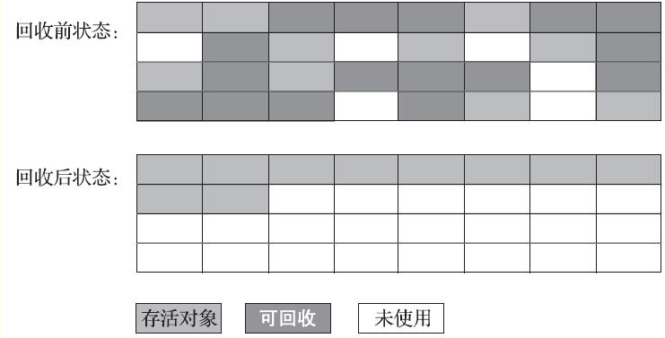

# 垃圾收集器与内存分配策略

## 确定对象状态

### 引用计数算法

Java 领域主流 JVM 没有使用引用计数算法的。原因在于这个看似简单的算法有很多例外情况要考虑，譬如单纯的引用计数就很难解决对象之间相互循环引用的问题。

### 可达性分析算法

通过一系列称为“GC Roots”的根对象作为起始节点集，从这些节点开始，根据引用关系向下搜索，搜索过程所走过的路径称为“引用链”（Reference Chain），如果某个对象到GC Roots间没有任何引用链相连，或者用图论的话来说就是从GC Roots到这个对象不可达时，则证明此对象是不可能再被使用的。

GC Roots的对象包括以下几种：
- 在虚拟机栈（栈帧中的本地变量表）中引用的对象：方法入参、局部变量、临时变量等。
- 在方法区中类静态属性引用的对象，譬如Java类的引用类型静态变量。
- 在方法区中常量引用的对象，譬如字符串常量池（String Table）里的引用。
- 在本地方法栈中JNI（即通常所说的Native方法）引用的对象。
- Java虚拟机内部的引用：基本数据类型对应的Class对象，一些常驻的异常对象，还有系统类加载器
- 所有被同步锁（synchronized关键字）持有的对象。

### 引用（Refrence）

`强引用（Strongly Re-ference）`、`软引用（Soft Reference）`、`弱引用（Weak Reference）`和`虚引用（Phantom Reference）`4种，这4种引用强度依次逐渐减弱。

- 强引用是最传统的“引用”的定义，是指在程序代码之中普遍存在的引用赋值，即类似“Object obj=new Object()”这种引用关系。无论任何情况下，只要强引用关系还存在，垃圾收集器就永远不会回收掉被引用的对象。

- 软引用是用来描述一些还有用，但非必须的对象。只被软引用关联着的对象，在系统将要发生内存溢出异常前，会把这些对象列进回收范围之中进行第二次回收，如果这次回收还没有足够的内存，才会抛出内存溢出异常。

- 弱引用也是用来描述那些非必须对象，但是它的强度比软引用更弱一些，被弱引用关联的对象只能生存到下一次垃圾收集发生为止。当垃圾收集器开始工作，无论当前内存是否足够，都会回收掉只被弱引用关联的对象。

- 虚引用也称为“幽灵引用”或者“幻影引用”，它是最弱的一种引用关系。一个对象是否有虚引用的存在，完全不会对其生存时间构成影响，也无法通过虚引用来取得一个对象实例。为一个对象设置虚引用关联的唯一目的只是为了能在这个对象被收集器回收时收到一个系统通知。

### 回收方法区

方法区的垃圾收集主要回收两部分内容：`废弃的常量`和`不再使用的类型`。

但用的真的很少这里就不记录了。

## 垃圾收集算法

### 分代收集理论

大多数都遵循了“分代收集”，建立在两个假说之上：
> 弱分代假说（Weak Generational Hypothesis）：绝大多数对象都是朝生夕灭的。          
> 强分代假说（Strong Generational Hypothesis）：熬过越多次垃圾收集过程的对象就越难以消亡

其核心思路：**收集器应该将Java堆划分出不同的区域，然后将回收对象依据其年龄（年龄即对象熬过垃圾收集过程的次数）分配到不同的区域之中存储。显而易见，如果一个区域中大多数对象都是朝生夕灭，难以熬过垃圾收集过程的话，那么把它们集中放在一起，每次回收时只关注如何保留少量存活而不是去标记那些大量将要被回收的对象，就能以较低代价回收到大量的空间；如果剩下的都是难以消亡的对象，那把它们集中放在一块，虚拟机便可以使用较低的频率来回收这个区域，这就同时兼顾了垃圾收集的时间开销和内存的空间有效利用。**

但是实际操作比较复杂，因为可能出现新生代和老年代的跨代引用。不然每次GC时都要扫描老年代的对象。

除此之外还有一个暗含的假说：
> 跨代引用假说（Intergenerational Reference Hypothesis）：跨代引用相对于同代引用来说仅占极少数

跟据这条假说，无需每次都扫描老年代，只需要在新生代建立一个全局的数据结构，用来标记老年代哪块内存会出现跨代的情况。发生Minor GC时，扫描相应的GC Roots，这样就不用扫描全部的老年代。兼顾正确性和开销。

### GC 分类：
部分收集（Partial GC）：指目标不是完整收集整个Java堆的垃圾收集，其中又分为：

- 新生代收集（Minor GC/Young GC）：指目标只是新生代的垃圾收集。

- 老年代收集（Major GC/Old GC）：指目标只是老年代的垃圾收集。

- 混合收集（Mixed GC）：指目标是收集整个新生代以及部分老年代的垃圾收集。

整堆收集（Full GC）：收集整个Java堆和方法区的垃圾收集。

### 标记-清除算法（Mark-Sweep）

算法分为“标记”和“清除”两个阶段：首先标记出所有需要回收的对象，在标记完成后，统一回收掉所有被标记的对象，也可以反过来，标记存活的对象，统一回收所有未被标记的对象。

缺点：
- 执行效率不稳定：如果Java堆中包含大量对象，而且其中大部分是需要被回收的，这时必须进行大量标记和清除的动作，导致标记和清除两个过程的执行效率都随对象数量增长而降低；
- 内存空间的碎片化问题：标记、清除之后会产生大量不连续的内存碎片，空间碎片太多可能会导致当以后在程序运行过程中需要分配较大对象时无法找到足够的连续内存而不得不提前触发另一次垃圾收集动作。

### 标记-复制算法（Semispace Copying）

它将可用内存按容量划分为大小相等的两块，每次只使用其中的一块。当这一块的内存用完了，就将还存活着的对象复制到另外一块上面，然后再把已使用过的内存空间一次清理掉。毕竟大部分情况，需要复制的对象比较少。

缺点：这种复制回收算法的代价是将可用内存缩小为了原来的一半，空间浪费未免太多了一点。

#### 改进方式

不用1:1的方式进行分配。使用8:1:1的方式进行。（Eden ：Survivor ：Survivor ）
每次分配使用一个 Eden 和一个 Survivor，GC时，把剩下对象放到另一个Survivor中。同时设计了用老年代来做担保空间，如果Survivor不够的话，直接放到老年代中。

### 标记-整理算法（Mark-Compact）

主要是针对老年代对象的存亡特征。其中的标记过程仍然与“标记-清除”算法一样，但后续步骤不是直接对可回收对象进行清理，而是让所有存活的对象都向内存空间一端移动，然后直接清理掉边界以外的内存。

