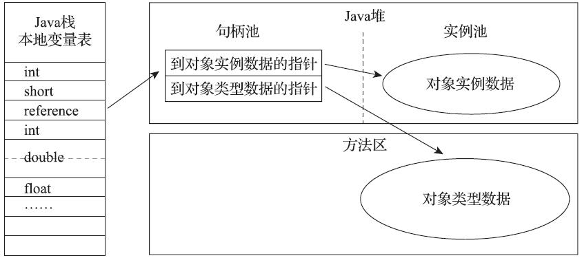

# 自动内存管理

## 运行时数据区域

总共5个区域：`方法区`，`虚拟机栈`，`本地方法栈`，`堆`，`程序计数区`


### 程序计数区（Program Counter Register）

功能：当前线程所执行的字节码的行号指示器

是否共享：线程私有

额外：如果线程正在执行的是一个Java方法，这个计数器记录的是正在执行的虚拟机字节码指令的地址；如果正在执行的是本地（Native）方法，这个计数器值则应为空（Undefined）

异常情况：没有规定任何OutOfMemoryError情况的区域

### Java虚拟机栈（Java Virtual Machine Stack）

功能：每个方法被执行的时候，Java虚拟机都会同步创建一个栈帧（Stack Frame）用于存储局部变量表、操作数栈、动态连接、方法出口等信息。每一个方法被调用直至执行完毕的过程，就对应着一个栈帧在虚拟机栈中从入栈到出栈的过程

是否共享：线程私有

异常情况：StackOverflowError OutOfMemoryError（初始化分配不成功才会，不会动态分配）

### 本地方法栈（Native Method Stacks）

功能：类似虚拟机栈，不过针对的是本地（Native）方法。

是否共享：线程私有

异常情况：StackOverflowError OutOfMemoryError（初始化分配不成功才会，不会动态分配）

### Java堆（Java Heap）

功能：此内存区域的唯一目的就是存放对象实例

是否共享：线程共享

额外：是虚拟机所管理的内存中最大的一块，如果从分配内存的角度看，所有线程共享的Java堆中可以划分出多个线程私有的分配缓冲区（Thread Local Allocation Buffer，TLAB），以提升对象分配时的效率。

异常情况：OutOfMemoryError

### 方法区（Method Area）

功能：它用于存储已被虚拟机加载的类型信息、常量、静态变量、即时编译器编译后的代码缓存等数据

是否共享：线程共享

异常情况：OutOfMemoryError

#### 运行时常量池（Runtime Constant Pool）

功能：是方法区的一部分。Class文件中除了有类的版本、字段、方法、接口等描述信息外，还有一项信息是常量池表（Constant Pool Table），用于存放编译期生成的各种字面量与符号引用，这部分内容将在类加载后存放到方法区的运行时常量池中。

是否共享：线程共享

异常情况：OutOfMemoryError

### 直接内存（Direct Memory）

功能：并不是虚拟机运行时数据区的一部分，也不是《Java虚拟机规范》中定义的内存区域。

额外：在JDK 1.4中新加入了NIO（New Input/Output）类，引入了一种基于通道（Channel）与缓冲区（Buffer）的I/O方式，它可以使用Native函数库直接分配堆外内存，然后通过一个存储在Java堆里面的DirectByteBuffer对象作为这块内存的引用进行操作

异常情况：OutOfMemoryError


## 虚拟机对象

### 对象创建
基本概念：

- 指针碰撞（Bump The Pointer）：假设Java堆中内存是绝对规整的，所有被使用过的内存都被放在一边，空闲的内存被放在另一边，中间放着一个指针作为分界点的指示器，那所分配内存就仅仅是把那个指针向空闲空间方向挪动一段与对象大小相等的距离

- 空闲列表（Bump The Pointer）：虚拟机就必须维护一个列表，记录上哪些内存块是可用的，在分配的时候从列表中找到一块足够大的空间划分给对象实例，并更新列表上的记录。


接受到new指令之后：
```java
fun newFunc（String class）{
    if（常量池中定位到一个类的符号引用 
        && 检查这个符号引用代表的类是否已被加载、解析和初始化过）{
        
        alloc 内存 //在类加载之后就能确定大小
        初始化 内存空间 //全都设为0值，保证了对象的实例字段在Java代码中可以不赋初始值就直接使用，使程序能访问到这些字段的数据类型所对应的零值
        设置 ObjectHeader // 对象是哪个类的实例 类的元数据信息 hashCode 等

        // 至此，Java 对象已经产生

        exec <init>() // 构造函数执行


    }else{
        exce 类加载过程
        newFunc(class)
    }
}
```

如何保证内存划分时线程安全问题：
- 一种是对分配内存空间的动作进行同步处理——实际上虚拟机是采用CAS配上失败重试的方式保证更新操作的原子性；
- 另外一种是把内存分配的动作按照线程划分在不同的空间之中进行，即每个线程在Java堆中预先分配一小块内存，称为本地线程分配缓冲（Thread Local Allocation Buffer，TLAB），哪个线程要分配内存，就在哪个线程的本地缓冲区中分配，只有本地缓冲区用完了，分配新的缓存区时才需要同步锁定。

### 对象的内存布局

堆内存中的存储布局可以划分为三个部分：`对象头（Header）`、`实例数据（Instance Data`）和`对齐填充（Padding）`

#### 对象头
- 存储对象自身的运行时数据：HashCode，GC分代年龄，锁状态标志、线程持有的锁、偏向线程ID、偏向时间戳
- 类型指针：即对象指向它的类型元数据的指针，Java虚拟机通过这个指针来确定该对象是哪个类的实例
- 数组长度数据：仅针对对象为一个java数组

#### 实例数据
我们在程序代码里面所定义的各种类型的字段内容，无论是从父类继承下来的，还是在子类中定义的字段都必须记录起来

#### 对齐填充
非必要，仅仅是填充。由于HotSpot虚拟机的自动内存管理系统要求对象起始地址必须是8字节的整数倍，换句话说就是任何对象的大小都必须是8字节的整数倍。对象头部分已经被精心设计成正好是8字节的倍数（1倍或者2倍），因此，如果对象实例数据部分没有对齐的话，就需要通过对齐填充来补全。


### 对象的访问定位
在栈上的reference数据来操作堆上的具体对象。通常有两种操作方式：

#### 句柄（Handle）

Java堆中将可能会划分出一块内存来作为句柄池，reference中存储的就是对象的句柄地址，而句柄中包含了对象实例数据与类型数据各自具体的地址信息。


优点：reference中存储的是稳定句柄地址，在对象被移动（垃圾收集时移动对象是非常普遍的行为）时只会改变句柄中的实例数据指针，而reference本身不需要被修改

#### 直接指针（Direct Pointer）

Java堆中对象的内存布局就必须考虑如何放置访问类型数据的相关信息，reference中存储的直接就是对象地址，如果只是访问对象本身的话，就不需要多一次间接访问的开销。


优点：直接指针来访问最大的好处就是速度更快，它节省了一次指针定位的时间开销，由于对象访问在Java中非常频繁，因此这类开销积少成多也是一项极为可观的执行成本。


