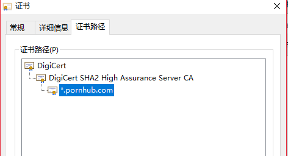

# 网络基础 HTTP 与 HTTPS

## HTTP
超文本传输协议。HTTP 协议是一个双向协议，HTTP 是一个在计算机世界里专门在「两点」之间「传输」文字、图片、音频、视频等「超文本」数据的「约定和规范」。

### 请求方法
请求方法可以参看[Retrofit源码 流程篇](https://arirus.cn/post/retrofit%E6%BA%90%E7%A0%81%E5%88%86%E6%9E%90%E7%B3%BB%E5%88%97-%E6%B5%81%E7%A8%8B%E7%AF%87/) 中有对多所有方法的举例，这里我们只说4个最常用的：

- GET 无副作用，幂等，不可带 Request Body
- POST 副作用，非幂等，可以带 Request Body
- PUT 副作用，幂等，可以带 Request Body
- DELETE 副作用，幂等，不可带 Request Body

这里有两个概念：**副作用**，**幂等**，副作用是对服务器产生的影响，幂等是多次操作造成的结果是否相同。GET 方法这样看无疑是最"安全"的方法，无论多少次操作都不会改变什么。但是 POST 和 PUT 两个是最容易让人混淆的，从使用者的角度二者没任何区别，但是从语义上来说，二者有很大的不同，如果有个 API 是上传文件到文件仓库，并不会把我上一次上传的文件给覆盖掉，那么我使用 POST 来描述这个 API 更合适，但是同样是上传文件，我想上传一个新的用户头像，就会把我之前的头像给完全替换掉，这样 API 应该被设计为 PUT 方法。这就是所谓的幂等，可以多次应用而不会改变初始应用之外的结果。

### 协议状态码
- `1xx` 类状态码属于提示信息，是协议处理中的一种中间状态，实际用到的比较少。
- `2xx` 类状态码表示服务器成功处理了客户端的请求，也是我们最愿意看到的状态。
    - `200 OK` 是最常见的成功状态码，表示一切正常。如果是非 HEAD 请求，服务器返回的响应头都会有 body 数据。
    - `204 No Content` 与 200 OK 基本相同，但响应头没有 body 数据。
    - `206 Partial Content` 是应用于 HTTP 分块下载或断电续传，表示响应返回的 body 数据并不是资源的全部，而是其中的一部分，也是服务器处理成功的状态。
- `3xx` 类状态码表示客户端请求的资源发送了变动，需要客户端用新的 URL 重新发送请求获取资源，也就是重定向。
    - `301 Moved Permanently` 表示永久重定向，说明请求的资源已经不存在了，需改用新的 URL 再次访问。
    - `302 Moved Permanently` 表示临时重定向，说明请求的资源还在，但暂时需要用另一个 URL 来访问。
    301 和 302 都会在响应头里使用字段 Location，指明后续要跳转的 URL，浏览器会自动重定向新的 URL。
    - `304 Not Modified` 不具有跳转的含义，表示资源未修改，重定向已存在的缓冲文件，也称缓存重定向，用于缓存控制。
-  `4xx` 类状态码表示客户端发送的报文有误，服务器无法处理，也就是错误码的含义。
    - `400 Bad Request` 表示客户端请求的报文有错误，但只是个笼统的错误。
    - `403 Forbidden` 表示服务器禁止访问资源，并不是客户端的请求出错。
    - `404 Not Found` 表示请求的资源在服务器上不存在或未找到，所以无法提供给客户端。
    4xx 系列还是说服务器已经收到请求了，但是资源或者请求有问题。
-   `5xx` 类状态码表示客户端请求报文正确，但是服务器处理时内部发生了错误，属于服务器端的错误码。
    - `502 Bad Gateway` 通常是服务器作为网关或代理时返回的错误码，表示服务器自身工作正常，访问后端服务器发生了错误。

被墙的网站其实都不是这些错误码返回，而是链接超时。

### 常见特性

#### 优点
- 简单：基本的报文格式就是 header + body
- 灵活和易于扩展：HTTP协议里的各类请求方法、URI/URL、状态码、头字段等每个组成要求都没有被固定死，都允许开发人员自定义和扩充。
- 应用广泛和跨平台

#### 缺点
- 无状态：每次请求都要带上Cookies
- 明文传输，不安全：信息可能被窃听，伪装，篡改

### 各个版本区别

#### HTTP 1.0
- 请求方式确立了GET，POST，DELETE，PUT，HEADER等方式
- 确立了请求头和响应头的概念，在通信中指定了 HTTP 协议版本号，以及其他的一些元信息 (比如: 状态码、权限、缓存、内容编码)
- 确立了传输内容格式，图片、音视频资源、二进制等都可以进行传输
- 确立了无状态的特性（Cookie 或者 Session）
- 确立了无连接的特性（短链接，每次请求都会创建新的TCP链接，无法复用；对头阻塞，前一个请求响应到达之后才会发送下一个）

##### 请求头
```
GET / HTTP/1.0
User-Agent: Mozilla/5.0 (Macintosh; Intel Mac OS X 10_10_5)
Accept: */*
```
请求方法 请求资源位置 请求协议版本 还有自定义的一些头部信息

##### 响应头
```
HTTP/1.0 200 OK
Content-Type: text/plain
Content-Length: 137582
Expires: Thu, 05 Dec 1997 16:00:00 GMT
Last-Modified: Wed, 5 August 1996 15:55:28 GMT
// 这是一个空行
...数据内容
```
响应协议版本 响应状态码 还有关于返回内容的描述

#### HTTP 1.1
- 长链接（新增Connection字段，可以设置keep-alive值保持连接不断开）
- 管道化（管道化可以不等第一个请求响应继续发送后面的请求，但响应的顺序还是按照请求的顺序返回，因此仍然无法解决队头阻塞的问题）
- 缓存处理（新增字段cache-control）
- 断点传输

#### 长链接
HTTP 长连接是1.1之后的版本比较常用的一种模式（所谓持久化），举个例子，现在网站非常大，除了 html 外还有很多 js css 文件，如果每次请求都是重新打开 HTTP 连接，那么开销会非常大，效率会非常低。使用 HTTP 的长连接，在一次连接的过程中可将这些所有的文件都传输过去。网上有个挺著名的图可以说清楚这点。


那么是不是说可以使用 HTTP 长连接来做 IM 功能，其实也不好。因为本质上没有变化，还是“请求-响应模式”，不过是减少了连接的握手次数，依然要一个发起请求一个响应请求。这种模式下如果要做 IM 功能，那就要使用 **轮询** 技术，客户端每隔一定时间向服务器请求查询，返回有没有新的数据。

所以从本质上来说，**HTTP 协议是不适合用作 IM 功能**，这是协议的性质决定的，不是修改某些技术细节可以改变的。

#### 管道化
1.0的请求如下：
```
（TCP连接 请求1 > 响应1 --> TCP断开） （TCP连接 --> 请求2 > 响应2 TCP断开） （TCP连接 --> 请求3 > 响应3 TCP连接）
```

1.1的请求如下：（长链接加管道化）
```
（TCP连接 请求1 --> 请求2 --> 请求3 > 响应1 --> 响应2 --> 响应3 --> TCP断开）
```
#### 缓存处理

Http 的缓存分为两种：强制缓存和对比缓存。强制缓存优先于对比缓存。

##### 强制缓存
客户端第一次请求数据时，服务端返回缓存的过期时间（通过字段 Expires 与 Cache-Control 标识），后续如果缓存没有过期就直接使用缓存，无需请求服务端；否则向服务端请求数据。

Expires

服务端返回的到期时间。下一次请求时，请求时间小于 Expires 的值，直接使用缓存数据。

由于到期时间是服务端生成，客户端和服务端的时间可能存在误差，导致缓存命中的误差。

Cache-Control

Http1.1 中采用了 Cache-Control 代替了 Expires，常见 Cache-Control 的取值有：

private: 客户端可以缓存
public: 客户端和代理服务器都可缓存
max-age=xxx: 缓存的内容将在 xxx 秒后失效
no-cache: 需要使用对比缓存来验证缓存数据，并不是字面意思
no-store: 所有内容都不会缓存，强制缓存，对比缓存都不会触发

##### 对比缓存
对比缓存每次请求都需要与服务器交互，由服务端判断是否可以使用缓存。

客户端第一次请求数据时,服务器会将缓存标识（Last-Modified/If-Modified-Since 与 Etag/If-None-Match）与数据一起返回给客户端，客户端将两者备份到缓存数据库中。

当再次请求数据时，客户端将备份的缓存标识发送给服务器，服务器根据缓存标识进行判断，返回 304 状态码，通知客户端可以使用缓存数据，服务端不需要将报文主体返回给客户端。

###### Last-Modified/If-Modified-Since

Last-Modified 表示资源上次修改的时间，在第一次请求时服务端返回给客户端。

客户端再次请求时，会在 header 里携带 If-Modified-Since ，将资源修改时间传给服务端。

服务端发现有 If-Modified-Since 字段，则与被请求资源的最后修改时间对比，如果资源的最后修改时间大于 If-Modified-Since，说明资源被改动了，则响应所有资源内容，返回状态码 200；否则说明资源无更新修改，则响应状态码 304，告知客户端继续使用所保存的缓存。

###### Etag/If-None-Match

优先于 Last-Modified/If-Modified-Since。

Etag 是当前资源在服务器的唯一标识，生成规则由服务器决定。当客户端第一次请求时，服务端会返回该标识。

当客户端再次请求数据时，在 header 中添加 If-None-Match 标识。

服务端发现有 If-None-Match 标识，则会与被请求资源对比，如果不同，说明资源被修改，返回 200；如果相同，说明资源无更新，响应 304，告知客户端继续使用缓存。

#### HTTP 2
- 二进制分帧：HTTP 2之后将所有传输的信息分割为更小的消息和帧，并对它们采用二进制格式的编码，提高传输效率
- 多路复用： 在共享TCP链接的基础上同时发送请求和响应
- 头部压缩
- 服务器推送：服务器可以额外的向客户端推送资源，而无需客户端明确的请求

##### 二进制分帧层

HTTP/2 所有性能增强的核心在于新的二进制分帧层，它定义了如何封装 HTTP 消息并在客户端与服务器之间传输。
其实就是将原先使用文本描述的协议，使用二进制帧进行封装，有利于提高效率。
其基本结构是这样的：
- 数据流（Stream）：已建立的连接内的双向字节流，可以承载一条或多条消息；每个流都有一个唯一的整数标识符（1、2…N）。
- 消息（message）：与逻辑请求或响应消息对应的完整的一系列帧。
- 帧（frame）：HTTP/2 通信的最小单位，每个帧都包含帧头，至少也会标识出当前帧所属的数据流，承载着特定类型的数据，如 HTTP 首部、负荷，等等。


##### 请求与响应复用
在 HTTP/1.x 中，如果客户端要想发起多个并行请求以提升性能，则必须使用多个 TCP 连接。
HTTP/2 中新的二进制分帧层突破了这些限制，实现了完整的请求和响应复用：客户端和服务器可以将 HTTP 消息分解为互不依赖的帧，然后交错发送，最后再在另一端把它们重新组装起来。
HTTP/2 中的新二进制分帧层解决了 HTTP/1.x 中存在的队首阻塞问题，也消除了并行处理和发送请求及响应时对多个连接的依赖。

##### 数据流优先级
由于很多帧的传输，传输这些帧的顺序就成为关键的性能决定因素。
共享相同父项的数据流（即，同级数据流）应按其权重比例分配资源。

##### 服务器推送
这也是由于使用了二进制分帧，有了stream的概念可以进行的。

##### 压缩标头
每一个请求都需要头部信息标识这次请求相关信息，所以会造成传输很多重复的信息，当请求数量增大的时候，消耗的资源就会慢慢积累上去。所以 HTTP 2 可以维护一个头部信息字典，差量进行更新头信息，减少头部信息传输占用的资源。

#### HTTP 3
改造了底层依赖，不再依赖 TCP 协议，而是使用一个基于 UDP 协议的 QUIC 协议，避免了因为TCP协议丢包重传而造成的数据阻塞的情况。


### HTTP 中授权的两种方式
都是利用HTTP request header来传递身份信息。
都需要后台给予验证身份的唯一ID（也可理解为唯一的验证信息）
#### Cookies
工作机制：

    服务器需要客户端保存的内容，放在 Set-Cookie headers 里返回，客户端会自动保存。
    客户端保存的 Cookies，会在之后的所有请求里都携带进 Cookie header 里发回给服务器。
    客户端保存 Cookie 是按照服务器域名来分类的，例例如 shop.com 发回的 Cookie 保存下来以后，在之后向 games.com 的请求中并不会携带。
    客户端保存的 Cookie 在超时后会被删除、没有设置超时时间的 Cookie （称作 Session Cookie）在浏览器关闭后就会⾃自动删除；另外，服务器也可以主动删除还未过期的客户端 Cookies。

使用 Cookies 来保持登录，就是使用通过服务端设置一个 session id 在 Cookie 中，每次客户端访问时将 session id 传给服务器来验证身份。本质上就是客户端拿着自己的 token 来进行验证。不过这个 Cookies 是由HTTP客户端自动添加到下一次的请求中，因此有可能被 js 获取。同时需要注意的是：session id 是会在服务端被存储了，每次新的请求会对比 session id ，用来确定用户信息，在这个层面来说 Cookies 是有状态的。

#### Authorization
Authorization 传输的 token 是无状态的（stateless）。也就是说，服务端不需要在数据库中存储和Token相关的字段，Token本身就已经包含了用户的所有信息。Token 可以由服务端返回的，也可以自己产生（Basic 方式就是由客户端自己来产生的，服务端只是获取信息），但是不会自己设定到 Header 上，需要用户手动将其设置到 Header 上。Authorization 分为两类 Basic 和 Bearer。

##### Basic
基本认证方式，其格式为：
    Authorization: Basic <username:password(Base64ed)>。
编码这一步骤的目的并不是安全与隐私，而是为将用户名和口令中的不兼容的字符转换为均与HTTP协议兼容的字符集。
因此如果仅仅是在HTTP协议上，使用 Authorization: Basic 和 Cookies 都是不够安全的。**Authorization: Basic 仅仅做身份信息的验证，没有任何的加密性在里面**，其安全性的保证是建立在 TLS/SSL 层面的。

##### Bearer
除了 Basic 方式，还支持使用 bearer 令牌通过OAuth 2.0保护资源。这种认证方式通常用于第三方授权。这里第一方是“我们”即用户，第二方是“资源提供者”（Google Photos等），第三方是“资源使用者”（各种 App）。 其格式为：
    
    Authorization: Bearer <bearer token>
传统的 Client-Server 模式在第三方授权时，有如下缺点：密码等信息会被第三方保存，这时候是相当与没有“权限”的概念的，相当于这个第三方应用就是你，可能会导致密码泄漏，同时也不方便撤销权限。

因此使用 OAuth 2.0 来保护资源是非常重要的。其流程是如下：
```java
+--------+                               +---------------+
|        |--(A)- Authorization Request ->|   Resource    |
|        |                               |     Owner     |
|        |<-(B)-- Authorization Grant ---|               |
|        |                               +---------------+
|        |
|        |                               +---------------+
|        |--(C)-- Authorization Grant -->| Authorization |
| Client |                               |     Server    |
|        |<-(D)----- Access Token -------|               |
|        |                               +---------------+
|        |
|        |                               +---------------+
|        |--(E)----- Access Token ------>|    Resource   |
|        |                               |     Server    |
|        |<-(F)--- Protected Resource ---|               |
+--------+                               +---------------+
```
这里 Client 就是第三方各种应用。Resource Owner 第一方通常是我们自己，拥有资源的所有权。Resource Server 第二方，保管我们的各种资源。Authorization Server 没有明确的指认，通常是可以和第二方沟通的，可以任务也是第二方，用来发放token认证。

流程是这样的：

    （A）用户打开客户端以后，客户端要求用户给予授权。

    （B）用户同意给予客户端授权。

    （C）客户端使用上一步获得的授权，向认证服务器申请令牌。

    （D）认证服务器对客户端进行认证以后，确认无误，同意发放令牌。

    （E）客户端使用令牌，向资源服务器申请获取资源。

    （F）资源服务器确认令牌无误，同意向客户端开放资源。

注意，上面六个步骤之中，B是关键，即用户怎样才能给于客户端授权。其中`授权码模式`是最严密的，功能最完整的模式。它的特点就是通过客户端的后台服务器，与"服务提供商"的认证服务器进行互动。而第三方应用的客户端不直接与认证服务器进行交流。区别在于客户端要求到了客户的授权，得到一个授权码，通过第三方的后台服务器与认证服务器建立连接，根据授权码获取相应的 token，最后将 token 返回到第三方的服务器，使用后可以向 Resource Server 请求资源。


这种做法是相信第三方的服务器，同时也尽量避免直接把 token 共享给第三方客户端使用，有取资源的操作尽量在第三方的服务器上完成。都是为了安全。

自家的 App 会在 Api 的设计中，将登录和授权设计成类似 OAuth2 的过程，但简化掉
Authorization code 概念。即：登录接⼝口请求成功时，会返回 access token，然后客户端在之
后的请求中，就可以使⽤用这个 access token 来当做 bearer token 进⾏行行⽤用户操作了了。

Refresh Token 可以向 Authorization Server 重新取得一個新的 Access Token，同时会使得现有的 Access Token 失效。
```java
+--------+                                           +---------------+
|        |--(A)------- Authorization Grant --------->|               |
|        |                                           |               |
|        |<-(B)----------- Access Token -------------|               |
|        |               & Refresh Token             |               |
|        |                                           |               |
|        |                            +----------+   |               |
|        |--(C)---- Access Token ---->|          |   |               |
|        |                            |          |   |               |
|        |<-(D)- Protected Resource --| Resource |   | Authorization |
| Client |                            |  Server  |   |     Server    |
|        |--(E)---- Access Token ---->|          |   |               |
|        |                            |          |   |               |
|        |<-(F)- Invalid Token Error -|          |   |               |
|        |                            +----------+   |               |
|        |                                           |               |
|        |--(G)----------- Refresh Token ----------->|               |
|        |                                           |               |
|        |<-(H)----------- Access Token -------------|               |
+--------+           & Optional Refresh Token        +---------------+

```
用法：access token 有失效时间，在它失效后，调用 refresh token 接口，传入 refresh_token
来获取新的 access token。由于（在标准的 OAuth2 流程中）refresh token 永远只存在与第三方服务的服务
器中(不会暴露给第三方客户端)，因此 refresh token 几乎没有失窃的风险。


## HTTPS

非单独的协议，是HTTP建立在SSL/TLS上的。
HTTP 可以基于 UDP 实现么？不可以，因为HTTP要求是可靠的传输，因此不能使用 UDP 实现，可以使用别的可靠的传输层协议实现。

HTTPS经由HTTP进行通信，但利用SSL/TLS来加密数据包。HTTPS开发的主要目的，是供对网站服务器的身份认证，保护交换数据的隐私与完整性。并可在使用适当的**加密**和**服务器证书**可被验证且可被信任时，对窃听和中间人攻击提供合理的防护。因此使用 HTTPS 主要是为了预防**中间人攻击**和**窃听**。

防止窃听就相对来说简单些，因为 HTTP 是没有加密的，你的所有请求和响应路由器，服务商都知道，因此可能对请求进行窃听甚至篡改（加个广告啥的）。

其中加密是针对**窃听**问题而解决的，核心是商量一个对称密钥，这样 A 和 B 就可以直接使用加解密通信的数据了。

但是为什么协议加密后，甚至已经对内容使用了非对称加密依然会怕中间人攻击？因为之前我们所说的安全是完全建立在二者的连接已经建立，外界无法获取足够的密钥（公钥或者私钥）来将原文还原出来。但是如果，在连接建立之前就已经被别人顶上了怎么办？例如：A 与 B 打算进行通信，B 首先将 `B公钥` 发送给 A，让 A 进行加密，但此时 `B公钥` 被 C 拦截了，C 把自己的 `C公钥` 发送给了 A，A 不知道这个是假的，依然原路将自己的 `A公钥` 返回给 C。这样 C 就同时获取 `A公钥` 和 `B公钥`。最后 C 把自己的 `C公钥` 冒充 `A公钥` 又传送给 B。这样 A 与 B 都以为自己和对方建立了连接，其实都是和 C 建立连接，C 就既可以冒充 A 也可以冒充 B 来影响对方，这个就是著名的中间人攻击。

核心问题就是：
**我们无法确定和我们对接的这个对象，是否是安全的，而非冒充的中间人。无法证明**

这也是为什么第一次使用 SSH 登录服务器的时候，会有一个 Hash 对比的环节，让用户自己确认登录的这个服务器是不我们的目标服务器。

这里的根本原因就是第一次 B 向 A 发送 `B公钥` 时，这个公钥是不可信的，我不知道这个公钥是否是来自与 B。HTTPS 的证书就是为了解决这个问题的。


HTTPS的本质：

- 通过CA证书来验证对方的正确性
- 在客户端和服务器之间协商出一个对称的密钥，每次发送信息之前进行加密，收到之后解密。

在TCP三次握手连接之后，开始TLS的链接：（整个步骤都是 TCP 的）

    1 客户端请求建立 TLS 连接 （发送：TLS版本, 对称加密算法， 非对称加密算法， Hash算法，客户端随机数）
    2 服务端说好的 （返回：TLS版本, 对称加密算法， 非对称加密算法， Hash算法，客户端随机数，服务器随机数）
    3 服务器发回证书 (其实包含是服务器的公钥)
    4 客户端验证服务器证书 
        1.证书包括：证书持有者，有效期，持有者公钥等（这些部分被成为明文部分）。
        2.除了明文部分还包括 数字签名 ，它是由明文部分经过hash，并通过证书机构的私钥签名而得到的。
        3.客户端用证书机构的公钥对数字签名进行解签名，同时将证书的明文部分进行hash，对比二者结果。相同的话，我们就信任这个明文中的持有者公钥。
        4.那么这个证书机构怎么信任呢，它实际上在一个信任链上，而根证书的公钥是在系统内置的。
    5 客户端信任服务端之后，与服务器协商对称加密 （使用服务器公钥非对称加密 Pre-Master Secret，传给服务器）
    6 生成 Master Secret（非密钥，两端分别是使用 Pre-Master Secret，客户端随机数，服务端随机数生成，不传输）
    7 生成 客户端加密密钥，服务端加密密钥，客户端 Mac Secret，服务端 Mac Secret （两端分别生成，不传输）（其中加密密钥是**加密**原文的，Mac Secret用来构造Hash用来**验证**身份）
    8 客户端验证加密通信，发送之前的所有信息通过加密签名发过去
    9 服务器验证加密通信，发送之前的所有信息通过加密签名发过去
    10 开始正常发送消息 应用层消息：%SGDIGSIDS……%*&

最后一个，就算使用了HTTPS协议，里面的关键数据也不要用明文的？

为了说明上面一个问题，我们使用 Charles 代理来看看。

### Charles 代理
结合上面的 HTTPS 的知识，我们结合 Charles 抓包来看一下。本次代理使用的 Charles 版本为 4.2.7 正式版，所有代理均是通过 WEB 端来完成，没有使用移动端进行测试。

#### HTTP 代理
首先是 HTTP 代理测试，这里我们选取 [http://httpbin.org/](http://httpbin.org/) 这个网站进行测试。正常使用 Charles 抓包，可以得到如下的效果


因为没有使用 HTTPS，图中TLS数据全部都是为空。接下来我们看下HTTP传输内容：


一个标准的 HTTP 的请求，与响应，我们从中可以获取我们想要的所有内容。注意，如果对 HTTP 的 API 进行加密的话，最多就是加密 requestBody、responseBody ，部分的 Headers ，就是对传输数据内容的加密，而非整个 HTTP 的加密，因此安全性来说，依然是存在的。

#### HTTPS 代理
配置好 Charles 的 CA 证书，我们就可以开始进行 HTTPS 代理了。不过在开始之前，我们先看下正常情况下使用 HTTPS 请求的 CA 证书。



例如，当我们在浏览器中访问 P站 时，地址栏左侧会出现一个小锁的标识，点击进去可以看到证书的相关信息，包括根 CA 、使用者信息、指纹、签名算法等等，这个证书的根 CA 是 DigiCert，这个证书是存在电脑系统中的，因此我们认为是可信的（毕竟 CNNIC 用了都说好~~）。

好了，我们先来看下在没有开启 SSL 配置时，Charles 对于 HTTPS 的解析情况。也就是完全模拟一个观察者，就像网络供应商，各个路由器的角色一样，这里我们以访问[知乎](https://www.zhihu.com)为例：


解析情况入上图，我们知道在HTTPS开始传输数据之前TLS/SSL 建立时，客户端服务端是走的明文传输，这里我们也截获了诸如 TLS 版本，客户端支持的加密算法，服务器选择的加密算法等信息。我们再看其传输的具体内容：


Charles 无法解析，无论是发送的请求还是返回的响应都是无法显示。其显示的头部应该是 Charless 自己推断出来的，非真正解析，因为不符合标准 HTTP 请求头响应头格式（只是猜测）。也就是说对于另一个窃听者，他看到的也应该是一样的一个东西，无法解密。好了，我们开启 SSL 配置，再次尝试访问知乎，会发现抛出以下错误：


同时地址栏左侧变为显示不安全：


我们发现，现在由于 Charles 作为中间人来代理访问，对于 Chrome 客户端来说，服务器的证书发生了变化，因此可以视为发生了`中间人攻击`，因此拒绝我们继续访问知乎。那这里我们换另一个之前没有建立的HTTPS网站，进行测试，以[苏宁](https://www.suning.com)为例，并且在Chrome弹出证书信任页面时要进行`信任`，最后在 Charles 中进行观察:


不同于未开启 SSL 时的访问，请求的 Meathod，Content-Type 都是可以获取的。再对比下请求响应信息：


请求响应信息一应俱全，就像是没有使用HTTPS加密一样。

### 结论
那么我们先来说下问题的答案，使用了 HTTPS ，里面的数据还要不要使用明文传输？如果不想让用户自己能分析数据（抓包）, 还是要继续加密, 这样增加了破解的难度, 需要反编译 app 拿到加密密钥才能解密。如果只是不想让用户以外的第三方拿到数据, 那么用 HTTPS 足以, 防范中间人攻击即可, 也分两种情况：用的是 CA 签发的证书, 用系统接口发起 HTTPS 链接就会校验证书合法性了(这样是不是能完全避免中间攻击? 不一定, 如果有人能用CA签发**同域名证书**那么还是能进行的)用的是自签名证书, 就要手动对服务器证书进行合法性校验了。
最后，我们给出使用 HTTPS 的结论：

    1.使用 HTTPS 可以有效的`预防``中间人攻击`和`窃听`，其中证书用于验证服务端身份避免中间人攻击，加密避免被窃听；
    2.使用 HTTPS 时，如果不是用加密数据作为 Header 或 Body 传输，则同样有数据被泄漏的风险。