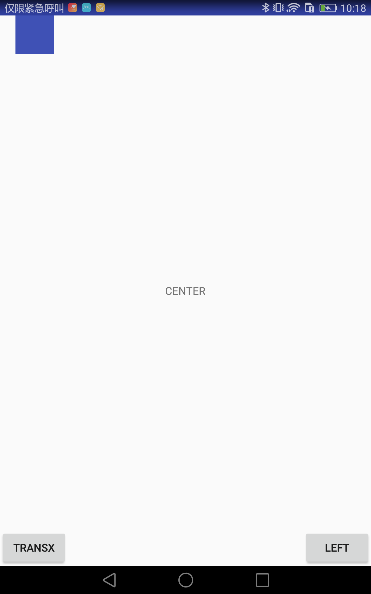
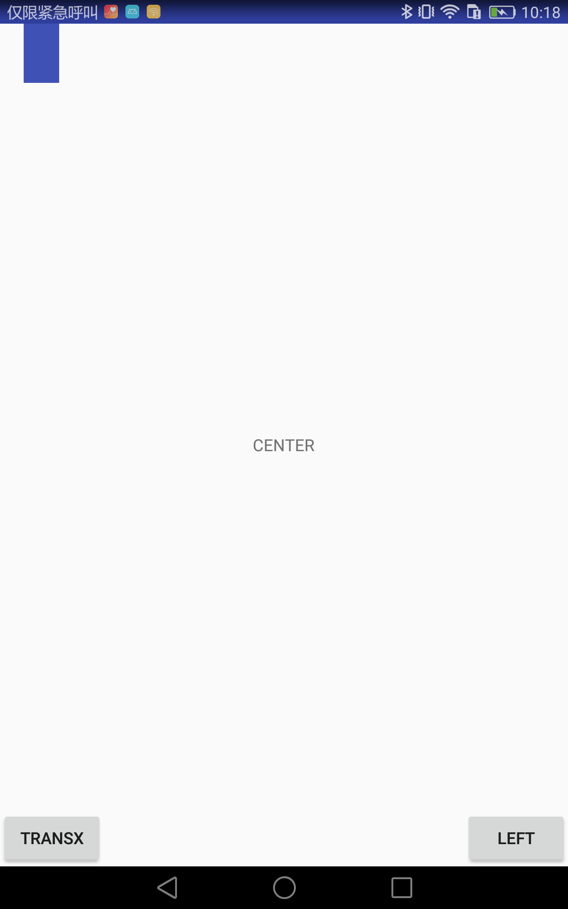
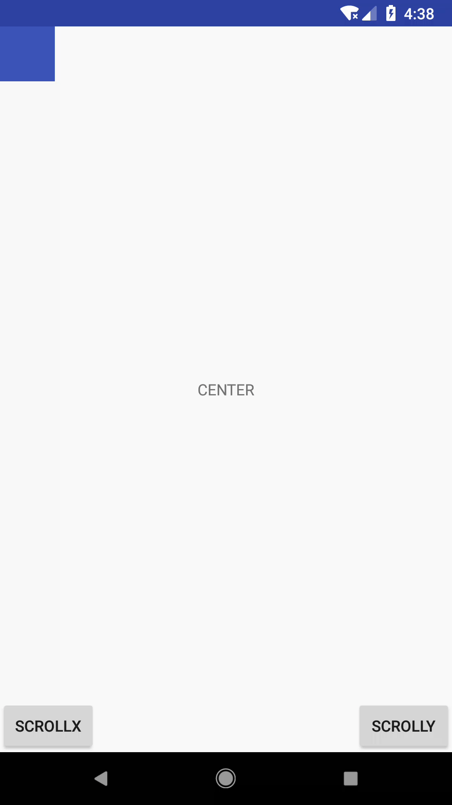

# 写在最前面
View 应该是除了 Activity 之外，Android 开发最常用的部分小到 Button 、TextView 大到自定义控件都离不开 View 的相关知识，无奈 View 这里过于庞大，因此知识点也是过于零碎，我们就结合着《开发艺术》 View 部分将其关键点做个总结，尽量做到有条理。注意：因为不是学习向的文章，因此在A知识点会出现B知识点、C知识点的内容，也可能会涉及到动画等知识点。

# 参数体系
View 的参数体系类似于图像学的体系，向右表示 X 轴正向，向下表示 Y 轴正向。一个 View 在坐标轴上可以通过 Left Top Right Bottom 来规定其**形状** ，通过左上角的坐标 (x, y) 规定其**位置**，（translationX,translationY）是左上角相对于父容器的偏移量，默认为0。其参数有如下转换关系：

    x = left + translationX
    y = top = translationY

**平移过程中，发生改变的只是 x, y, translationX, translationY。Left, Top, Right, Bottom 不会发生相应的改变**
那如果我们修改了会发生什么？这里做个小实验。


如图我们在左上角摆放一个控件，下面分别有两个按钮左边的是修改其 translationX，右边的是修改其 left 属性。都是通过属性动画的形式来修改。
```java
mButton1.setOnClickListener(v->ObjectAnimator.ofFloat(mWidget, "translationX", 50).setDuration(1000).start());
mButton2.setOnClickListener(v->ObjectAnimator.ofInt(mMainView, "left", 50).setDuration(1000).start());
```
两个按钮点击事件如上所示，点击左侧的按钮有如下效果：



控件整体向右平移，这个和我们设想的一样。然后我们点击右侧按钮，修改其 left 属性。



我们发现，控制整体并没有移动，但是左侧缺少了一块。所以，修改 Left Top Right Bottom 只是会使得控件的形状改变，不会是其位置发生改变。注意：如果 Left 大于 Right ，则控件会"消失"。

## VelocityTracker
通常我们使用 VelocityTracker 来获取当前速度:
```java
VelocityTracker velocityTracker = VelocityTracker.obtain(); //获取实例
velocityTracker.addMovement(event); //添加测算点
velocityTracker.computeCurrentVelocity(1000); //计算每秒的速度
Log.i(ARIRUS, "onTouchEvent MOVE: "+velocityTracker.getXVelocity()+" "+velocityTracker.getYVelocity()); //获取当前点的速度
//使用完要回收，避免内存泄漏
velocityTracker.clear();
velocityTracker.recycle();

log：
09-18 I/ARIRUS: onTouchEvent MOVE: 88.29766 353.1358
09-18 I/ARIRUS: onTouchEvent MOVE: 88.8327 621.83264
09-18 I/ARIRUS: onTouchEvent MOVE: 197.7845 692.2457
09-18 I/ARIRUS: onTouchEvent MOVE: 463.6489 1112.7579
09-18 I/ARIRUS: onTouchEvent UP: 0.0 0.0

```
注意：VelocityTracker 是用来获取手指速度的，因此在抬手的时刻是没有速度；其次，速度也分正负，x 轴正向移动，速度为正，y 轴正向移动，速度为正，反之为负。

# View 滑动
常见的滑动有三种：

    scrollTo/scrollBy； View 本身提供的滑动模式
    使用平移效果实现滑动；通常是使用动画实现
    修改 LayoutParams；修改位置参数实现滑动

##  scrollTo/scrollBy
scrollTo/scrollBy 实质上移动的是控件的内容的位置，其本身的 X，y，translationX，translationY 是不变的。View 中使用 `mScrollX`,`mScrollY` 来表示`视图内容的偏移`。如果视图内容从左向右，即视图本身从右向左移动则 mScrollX 为正，反之为负，同理 mScrollY。


还以刚才的为例，两个按钮改了分别是修改父容器的 mScrollX，mScrollY 属性：
```java
mButton1.setOnClickListener(v->ObjectAnimator.ofInt(mMainView, "scrollX", -50).setDuration(1000).start());
mButton2.setOnClickListener(v->ObjectAnimator.ofInt(mMainView, "scrollY", -50).setDuration(1000).start());
``` 


我们发现，确实是不光是左上角的控件平移了，连带着中央的文字，下册的按钮也全部都是平移了。所以如果要修改一个控件的坐标设置 scrollX scrollY 是不可以的，除非是对其父容器进行设置。
使用动画修改 transX，transY，就不再说了，上面已经使用了。最后设置 LayoutParams 用的很少，也不说了，其实就是获取获取布局参数，修改参数，重新设置很简单。

## 触摸滑动
本例中我们重写控件的 `onTouchEvent(MotionEvent)` 来分别使用 event 的 getX()，getY() 方法对和 getRawX() ,getRawY() 方法对分别举例来实现手指的触摸滑动。
```java
@Override
public boolean onTouchEvent(MotionEvent event) {
  switch (event.getAction()) {
    case MotionEvent.ACTION_DOWN:
      mLastX = event.getX();
      mLastY = event.getY();
      break;
    case MotionEvent.ACTION_MOVE:
      float deltaX = event.getX() - mLastX;
      float deltaY = event.getY() - mLastY;

      if (Math.sqrt(deltaX * deltaX + deltaY * deltaY) > mTouchSlop) {
        setX(getX() + deltaX);
        setY(getY() + deltaY);
        return true;
      }
      break;
    default:
      break;
  }
  return true;
}
```
首先是使用 getX getY 方法对：当按下时，获取当前手指相对于的控件的位置；然后每一次移动时，分别测算新的手指相对于控件的位置，并获取两次的差值；判断如果差值大于 TouchSlop ，则是滑动，将控件的位置设置为在原有位置上增加新的位置，实现滑动。

这个方法，其实以控件本身为参照物，手指每一次移动后，将控件移动到手指对应的位置，从而实现的滑动。

```java
 @Override
  public boolean onTouchEvent(MotionEvent event) {

    if (mLastX==0|| mLastY ==0){
      mLastX = event.getRawX();
      mLastY = event.getRawY();
    }

    switch (event.getAction()) {
      case MotionEvent.ACTION_MOVE:
        float deltaX = event.getRawX() - mLastX;
        float deltaY = event.getRawY() - mLastY;
        if (Math.sqrt(deltaX * deltaX + deltaY * deltaY) > mTouchSlop) {
          setX(getX()+ deltaX);
          setY(getY()+deltaY);
          break;
        }
        break;
      default :
        break;
    }

    mLastX = event.getRawX();
    mLastY = event.getRawY();
    return true;
  }
```
这个是使用 getRawX getRawY 来实现的滑动：首先第一触摸时，设置参照位置，这次是以整个屏幕为参考对象进行设置；每一次滑动，判断当前位置和上一次的位置的差别，如果足够大则将控件进行移动；最后要把参考位置进行更新以便下一次使用。

通过上面两个例子，说明以参照对象不同，实现的滑动方式也是不同的，第一种是判断每次手指移动后在view的位置相对于上一次的比较，第二种是判断每一次移动手指在屏幕上相对于上次的位置的比较，最后要根据合理性和自己的需要选择合适的方式。

# Scroller
上节我们讲到 View 的滑动，是以手指操控来实现的，那还有移动如果没有手指的滑动参与的，这样我们就不能在 OnTouchEvent 进行监听，每次滑动时改变其位置。针对这类的移动我们可以使用 Scroller 来实现。

现在在上面的拖动滑动的基础上再加一个新的功能，松手后使控件还返回到原先的位置(0,0)，这样我们在 ACTION_UP 时调用 Scroller 的相关方法来实现滑动操作。
```java
Scroller mScroller = new Scroller(context, new AccelerateDecelerateInterpolator());

@Override
public boolean onTouchEvent(MotionEvent event) {
  switch (event.getAction()) {
    ...
    case MotionEvent.ACTION_UP:
      mScroller.startScroll((int)getX(),(int)getY(),-(int)getX(),-(int)getY(),2000);
      invalidate();
      break;
    default:
      break;
  }
  return true;
}

@Override
public void computeScroll() {
  if (mScroller.computeScrollOffset()) {
    setX(mScroller.getCurrX());
    setY(mScroller.getCurrY());
    invalidate();
  }
}
```
构造函数中生成一个 Scroller 实例，在 ACTION_UP 时调用 startScroll 方法，并且强制重绘。注意这个方法中，**前两个参数是当前的位置,后两个参数是要移动的距离而不是目的地位置**。重绘时，会调用 View 中的 computeScroll 方法，我们需要实现这个方法。调用 computeScrollOffset() 判断滑动是否已经完成，如果没有完成，获取当前应该要在的位置并执行重设 x、y 的平移操作，最后再次重绘，这样便进入一个循环，不断重绘，每次都设置新的控件的坐标，直到完成。 



Scroller 最基本的使用方法，就是上面这样的。开始滑动->重绘->判断->重绘...->完成。我们可以看一下 computeScrollOffset 方法：
```java
public boolean computeScrollOffset() {
    if (mFinished) {
        return false;
    }

    int timePassed = (int)(AnimationUtils.currentAnimationTimeMillis() - mStartTime);

    if (timePassed < mDuration) {
        switch (mMode) {
        case SCROLL_MODE:
            final float x = mInterpolator.getInterpolation(timePassed * mDurationReciprocal);
            mCurrX = mStartX + Math.round(x * mDeltaX);
            mCurrY = mStartY + Math.round(x * mDeltaY);
            break;
        case FLING_MODE:
            ...
            break;
        }
    }
    else {
        mCurrX = mFinalX;
        mCurrY = mFinalY;
        mFinished = true;
    }
    return true;
}
```
因此对于滑动来说，如果流逝的时间小于总的执行时间则根据插值器来设置当前的位置，否则直接返回终点位置，因此 Scroller 其实只是一个计算工具，他只是返回每一个时刻控件应该所处的位置，而非控制控件移动，真正的移动还是要手动设置完成而已。

## OverScoller
是 API 9 引入的一个 Scroller 替代类，其实现了全部的 Scroller 的方法，我们可以将上述例子的 Scroller 替换为 OverScroller。当然除了基本的 Scroller 的方法，还有两个方法是新加入的：

    fling(int startX, int startY, int velocityX, int velocityY,
            int minX, int maxX, int minY, int maxY, int overX, int overY) //惯性滑动支持
    springBack(int startX, int startY, int minX, int maxX, int minY, int maxY) //回弹支持

分别来看下这两个方法。

### springBack
```java
/**
* startX startY 开始滑动的坐标
* minX maxX  控件x坐标最终会停在这个范围内
* minY maxY  控件y坐标最终会停在这个范围内
**/
springBack(int startX, int startY, int minX, int maxX, int minY, int maxY)
```

这里我把父控件切分成了4块，只允许控件最终停在左上角的一块中，当我们在左上角移动控件时，控件是移动后停止，但是如果我尝试将其停在别的块中，最终控件还是会滑动到左上角块内。

```java
 @Override
  public boolean onTouchEvent(MotionEvent event) {
    switch (event.getAction()) {
      ...
      case MotionEvent.ACTION_UP:
        mOverScroller.springBack((int)getX(),(int)getY(),0, ((View)getParent()).getWidth()/2-getWidth(),0,((View)getParent()).getHeight()/2-getHeight());
        invalidate();
        break;
    }
    return true;
  }
```
抬起指尖时，启动回弹（懒省事这里就不做返回判断了），其中 X 的范围最终在 `[0, ((View)getParent()).getWidth()/2-getWidth()]`,Y 的范围也同理 `[0,((View)getParent()).getHeight()/2-getHeight()]` 注意依然要重绘，不然无效。我们来看下这里的关键判断代码：
```java
boolean springback(int start, int min, int max) {
    mFinished = true;
    ...
    if (start < min) {
        startSpringback(start, min, 0);
    } else if (start > max) {
        startSpringback(start, max, 0);
    }

    return !mFinished;
}
```
当起始位置在 [min,max] 直接，则判断滑动已完成不会进行滑动，否则进行滑动测算，可以开始滑动。

## filing
其实是属于上一个类型的延申，我们先看下其函数签名：
```java
/**
* startX startY 开始滑动的坐标
* velocityX velocityY 当前的速度
* minX maxX  控件x坐标最终会停在这个范围内
* minY maxY  控件y坐标最终会停在这个范围内
* overX overY 允许超过的距离
**/
fling(int startX, int startY, int velocityX, int velocityY,int minX, int maxX, int minY, int maxY, int overX, int overY)
```

如图所示，如果指尖抬起时依然有速度则会进行惯性滑动，其滑动距离不会超过 overX， overY 的值，最终依然会停留在 [minX,maxX],[minY,maxY] 的范围内。

```java
mOverScroller.fling((int) getX(), (int) getY(), (int) mXV, (int) mYV, 0,
    ((View) getParent()).getWidth() / 2 - getWidth(), 0,
    ((View) getParent()).getHeight() / 1 - getHeight(), mXV > 0 ? (int) (getX()) : 0,
    mYV > 0 ? (int) (getY()) : 0);
invalidate();
```
在 ACTION_UP 时做如上操作，就可以实现惯性滑动回弹。

# 小结
本篇中，我们主要是了解下 View 的参考系，了解 x、y 与 Left、Top、Right、Bottom 的区别。其次是分析了 scrollTo/scrollBy 的应用，并实现了触摸滑动，最后分析了 Scroller 在滑动中的应用，实现了一个简单的无触摸滑动，同时分析 OverScroller 与 Scroller 的差异，给出了两个例子。那么本篇的文章就到此结束了。